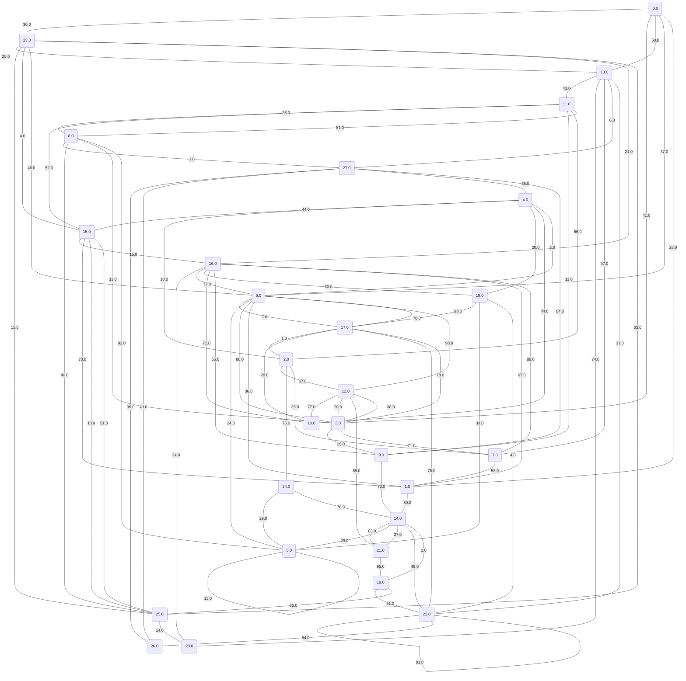

```mermaid
graph TD;
	0("0.0");
	1("1.0");
	2("2.0");
	3("3.0");
	4("4.0");
	5("5.0");
	6("6.0");
	7("7.0");
	8("8.0");
	9("9.0");
	10("10.0");
	11("11.0");
	12("12.0");
	13("13.0");
	14("14.0");
	15("15.0");
	16("16.0");
	17("17.0");
	18("18.0");
	19("19.0");
	20("20.0");
	21("21.0");
	22("22.0");
	23("23.0");
	24("24.0");
	25("25.0");
	26("26.0");
	27("27.0");
	8 -- "1.0" --- 27;
	2 -- "67.0" --- 12;
	7 -- "25.0" --- 2;
	11 -- "26.0" --- 8;
	15 -- "15.0" --- 16;
	9 -- "84.0" --- 27;
	12 -- "77.0" --- 10;
	23 -- "28.0" --- 13;
	19 -- "78.0" --- 17;
	1 -- "67.0" --- 16;
	9 -- "73.0" --- 14;
	23 -- "15.0" --- 25;
	17 -- "1.0" --- 2;
	5 -- "92.0" --- 8;
	22 -- "48.0" --- 14;
	23 -- "4.0" --- 15;
	3 -- "25.0" --- 9;
	14 -- "63.0" --- 21;
	15 -- "73.0" --- 1;
	22 -- "81.0" --- 22;
	3 -- "78.0" --- 17;
	27 -- "95.0" --- 26;
	4 -- "44.0" --- 15;
	6 -- "37.0" --- 0;
	11 -- "52.0" --- 15;
	27 -- "6.0" --- 13;
	10 -- "44.0" --- 4;
	4 -- "10.0" --- 2;
	21 -- "37.0" --- 14;
	23 -- "46.0" --- 6;
	12 -- "20.0" --- 3;
	25 -- "63.0" --- 23;
	17 -- "28.0" --- 10;
	10 -- "71.0" --- 16;
	7 -- "58.0" --- 1;
	4 -- "20.0" --- 19;
	2 -- "56.0" --- 11;
	16 -- "21.0" --- 23;
	22 -- "78.0" --- 17;
	11 -- "11.0" --- 9;
	6 -- "7.0" --- 17;
	19 -- "33.0" --- 5;
	5 -- "13.0" --- 5;
	1 -- "89.0" --- 14;
	13 -- "50.0" --- 0;
	6 -- "24.0" --- 5;
	13 -- "43.0" --- 11;
	6 -- "86.0" --- 3;
	13 -- "74.0" --- 20;
	24 -- "29.0" --- 5;
	18 -- "51.0" --- 22;
	18 -- "2.0" --- 14;
	24 -- "78.0" --- 14;
	9 -- "65.0" --- 16;
	14 -- "29.0" --- 5;
	12 -- "65.0" --- 21;
	16 -- "24.0" --- 20;
	16 -- "77.0" --- 6;
	22 -- "54.0" --- 26;
	16 -- "30.0" --- 19;
	0 -- "30.0" --- 23;
	8 -- "40.0" --- 25;
	6 -- "36.0" --- 1;
	8 -- "33.0" --- 3;
	0 -- "41.0" --- 3;
	25 -- "14.0" --- 20;
	13 -- "97.0" --- 7;
	3 -- "71.0" --- 7;
	17 -- "93.0" --- 6;
	27 -- "40.0" --- 26;
	22 -- "31.0" --- 13;
	19 -- "4.0" --- 22;
	18 -- "85.0" --- 25;
	3 -- "38.0" --- 12;
	15 -- "18.0" --- 25;
	21 -- "95.0" --- 18;
	6 -- "2.0" --- 4;
	2 -- "75.0" --- 24;
	1 -- "28.0" --- 0;
	8 -- "81.0" --- 11;
	15 -- "51.0" --- 25;
	7 -- "89.0" --- 16;
	6 -- "98.0" --- 12;
	27 -- "35.0" --- 4;
```

