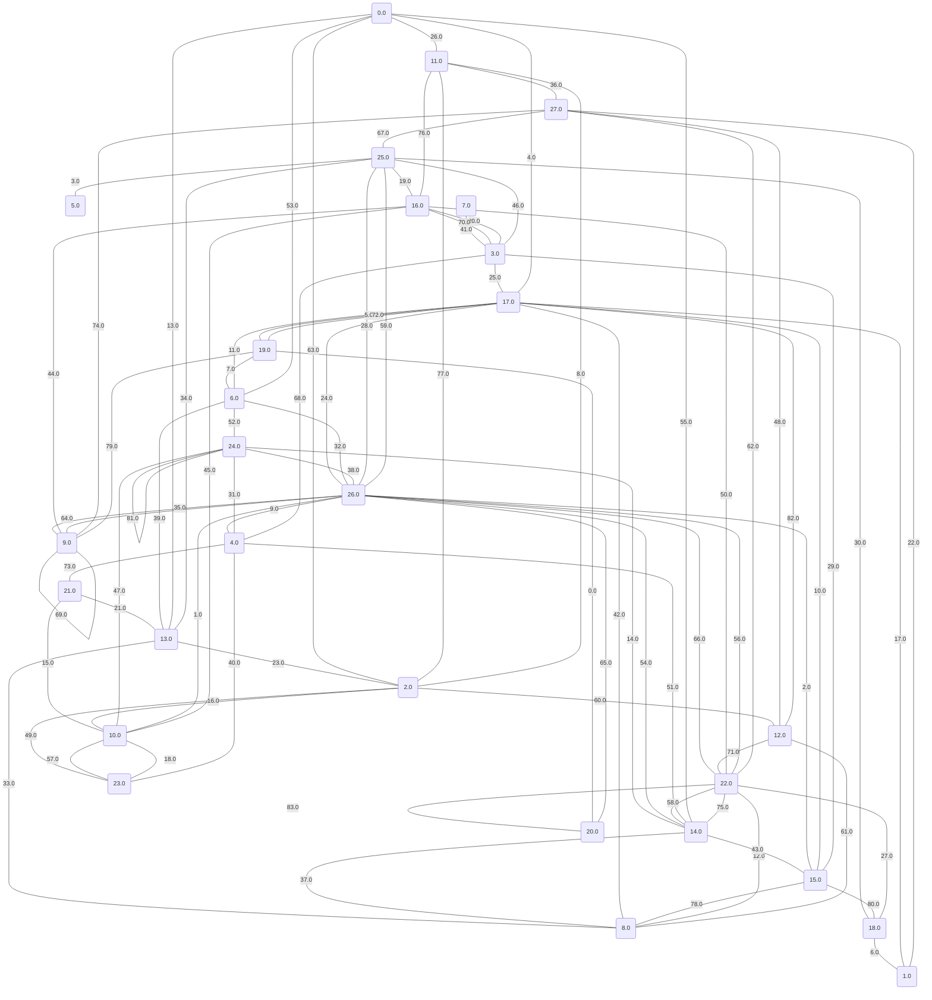

```mermaid
graph TD;
0("0.0");
1("1.0");
2("2.0");
3("3.0");
4("4.0");
5("5.0");
6("6.0");
7("7.0");
8("8.0");
9("9.0");
10("10.0");
11("11.0");
12("12.0");
13("13.0");
14("14.0");
15("15.0");
16("16.0");
17("17.0");
18("18.0");
19("19.0");
20("20.0");
21("21.0");
22("22.0");
23("23.0");
24("24.0");
25("25.0");
26("26.0");
27("27.0");
	20 -- "0.0" --- 19;
	10 -- "1.0" --- 26;
	15 -- "2.0" --- 26;
	25 -- "3.0" --- 5;
	17 -- "4.0" --- 0;
	17 -- "5.0" --- 19;
	18 -- "6.0" --- 1;
	19 -- "7.0" --- 6;
	2 -- "8.0" --- 11;
	26 -- "9.0" --- 4;
	15 -- "10.0" --- 17;
	6 -- "11.0" --- 17;
	8 -- "12.0" --- 22;
	13 -- "13.0" --- 0;
	24 -- "14.0" --- 14;
	21 -- "15.0" --- 10;
	2 -- "16.0" --- 10;
	17 -- "17.0" --- 1;
	23 -- "18.0" --- 10;
	25 -- "19.0" --- 16;
	3 -- "20.0" --- 16;
	21 -- "21.0" --- 13;
	1 -- "22.0" --- 27;
	13 -- "23.0" --- 2;
	17 -- "24.0" --- 26;
	3 -- "25.0" --- 17;
	0 -- "26.0" --- 11;
	18 -- "27.0" --- 22;
	26 -- "28.0" --- 25;
	15 -- "29.0" --- 3;
	25 -- "30.0" --- 18;
	24 -- "31.0" --- 4;
	6 -- "32.0" --- 26;
	13 -- "33.0" --- 8;
	13 -- "34.0" --- 25;
	26 -- "35.0" --- 9;
	11 -- "36.0" --- 27;
	14 -- "37.0" --- 8;
	24 -- "38.0" --- 26;
	6 -- "39.0" --- 13;
	23 -- "40.0" --- 4;
	7 -- "41.0" --- 3;
	17 -- "42.0" --- 8;
	14 -- "43.0" --- 15;
	9 -- "44.0" --- 16;
	10 -- "45.0" --- 16;
	3 -- "46.0" --- 25;
	24 -- "47.0" --- 10;
	12 -- "48.0" --- 27;
	2 -- "49.0" --- 23;
	22 -- "50.0" --- 16;
	14 -- "51.0" --- 4;
	6 -- "52.0" --- 24;
	6 -- "53.0" --- 0;
	26 -- "54.0" --- 14;
	14 -- "55.0" --- 0;
	22 -- "56.0" --- 26;
	10 -- "57.0" --- 23;
	22 -- "58.0" --- 14;
	26 -- "59.0" --- 25;
	2 -- "60.0" --- 12;
	8 -- "61.0" --- 12;
	22 -- "62.0" --- 27;
	0 -- "63.0" --- 2;
	9 -- "64.0" --- 26;
	20 -- "65.0" --- 26;
	26 -- "66.0" --- 22;
	27 -- "67.0" --- 25;
	4 -- "68.0" --- 3;
	9 -- "69.0" --- 9;
	16 -- "70.0" --- 3;
	12 -- "71.0" --- 22;
	17 -- "72.0" --- 19;
	4 -- "73.0" --- 21;
	9 -- "74.0" --- 27;
	14 -- "75.0" --- 22;
	11 -- "76.0" --- 16;
	11 -- "77.0" --- 2;
	15 -- "78.0" --- 8;
	9 -- "79.0" --- 19;
	15 -- "80.0" --- 18;
	24 -- "81.0" --- 24;
	12 -- "82.0" --- 17;
	22 -- "83.0" --- 20;
```
