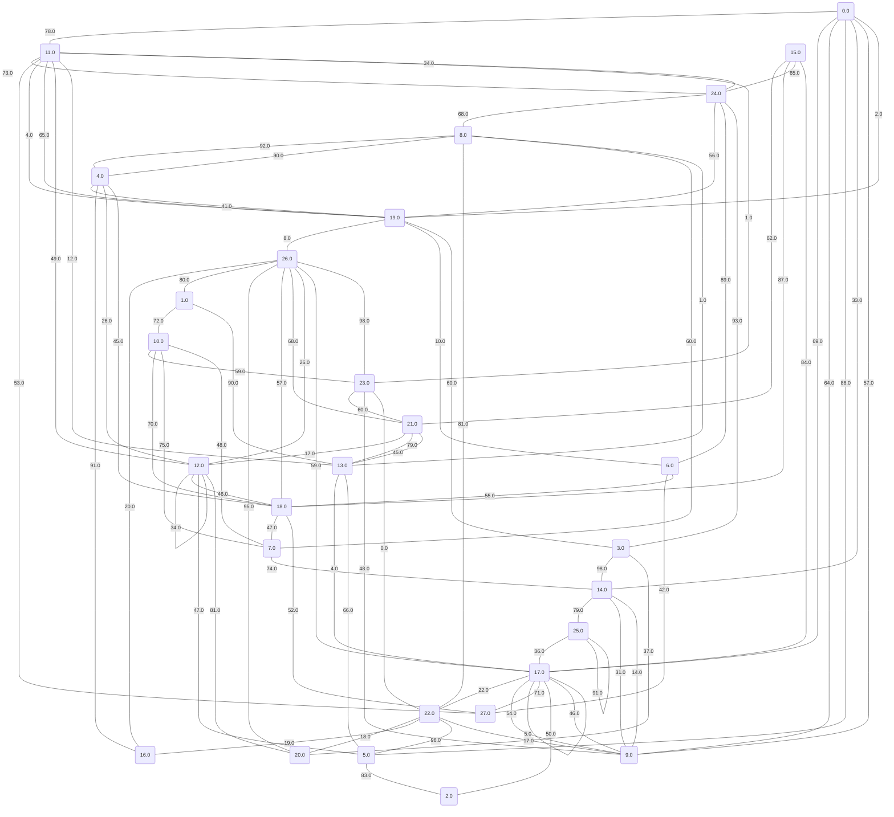

```mermaid
graph TD;
	0("0.0");
	1("1.0");
	2("2.0");
	3("3.0");
	4("4.0");
	5("5.0");
	6("6.0");
	7("7.0");
	8("8.0");
	9("9.0");
	10("10.0");
	11("11.0");
	12("12.0");
	13("13.0");
	14("14.0");
	15("15.0");
	16("16.0");
	17("17.0");
	18("18.0");
	19("19.0");
	20("20.0");
	21("21.0");
	22("22.0");
	23("23.0");
	24("24.0");
	25("25.0");
	26("26.0");
	27("27.0");
	23 -- "60.0" --- 21;
	26 -- "20.0" --- 16;
	13 -- "4.0" --- 17;
	7 -- "74.0" --- 14;
	27 -- "52.0" --- 18;
	18 -- "45.0" --- 4;
	22 -- "18.0" --- 20;
	15 -- "62.0" --- 21;
	25 -- "36.0" --- 17;
	19 -- "8.0" --- 26;
	12 -- "26.0" --- 26;
	0 -- "78.0" --- 11;
	22 -- "81.0" --- 8;
	3 -- "98.0" --- 14;
	17 -- "22.0" --- 22;
	12 -- "26.0" --- 4;
	19 -- "10.0" --- 6;
	14 -- "79.0" --- 25;
	26 -- "80.0" --- 1;
	13 -- "45.0" --- 21;
	15 -- "87.0" --- 18;
	17 -- "59.0" --- 26;
	10 -- "59.0" --- 23;
	26 -- "95.0" --- 20;
	12 -- "49.0" --- 11;
	17 -- "54.0" --- 9;
	0 -- "69.0" --- 17;
	17 -- "5.0" --- 17;
	0 -- "64.0" --- 9;
	26 -- "57.0" --- 18;
	14 -- "31.0" --- 9;
	1 -- "72.0" --- 10;
	19 -- "60.0" --- 3;
	11 -- "73.0" --- 24;
	26 -- "68.0" --- 21;
	24 -- "68.0" --- 8;
	5 -- "83.0" --- 2;
	17 -- "71.0" --- 27;
	6 -- "42.0" --- 27;
	12 -- "34.0" --- 12;
	14 -- "14.0" --- 9;
	17 -- "50.0" --- 2;
	24 -- "34.0" --- 11;
	15 -- "65.0" --- 24;
	4 -- "90.0" --- 8;
	18 -- "70.0" --- 10;
	15 -- "84.0" --- 17;
	23 -- "1.0" --- 11;
	7 -- "75.0" --- 10;
	11 -- "53.0" --- 27;
	25 -- "91.0" --- 25;
	6 -- "55.0" --- 18;
	0 -- "86.0" --- 5;
	22 -- "19.0" --- 16;
	16 -- "91.0" --- 4;
	0 -- "33.0" --- 14;
	6 -- "89.0" --- 24;
	18 -- "47.0" --- 7;
	13 -- "1.0" --- 8;
	12 -- "46.0" --- 18;
	24 -- "56.0" --- 19;
	3 -- "93.0" --- 24;
	12 -- "47.0" --- 5;
	13 -- "90.0" --- 1;
	9 -- "57.0" --- 0;
	13 -- "12.0" --- 11;
	19 -- "2.0" --- 0;
	22 -- "96.0" --- 5;
	7 -- "48.0" --- 10;
	3 -- "37.0" --- 20;
	22 -- "17.0" --- 9;
	21 -- "17.0" --- 12;
	4 -- "41.0" --- 19;
	13 -- "66.0" --- 5;
	7 -- "60.0" --- 8;
	9 -- "46.0" --- 17;
	11 -- "4.0" --- 19;
	8 -- "92.0" --- 4;
	20 -- "81.0" --- 12;
	23 -- "98.0" --- 26;
	22 -- "0.0" --- 23;
	23 -- "48.0" --- 9;
	21 -- "79.0" --- 13;
	11 -- "65.0" --- 19;
```

