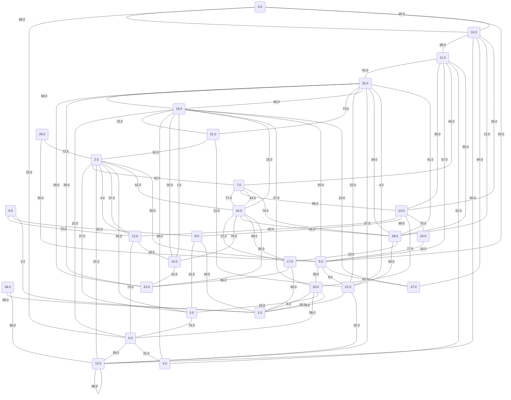

```mermaid
graph TD;
	0("0.0");
	1("1.0");
	2("2.0");
	3("3.0");
	4("4.0");
	5("5.0");
	6("6.0");
	7("7.0");
	8("8.0");
	9("9.0");
	10("10.0");
	11("11.0");
	12("12.0");
	13("13.0");
	14("14.0");
	15("15.0");
	16("16.0");
	17("17.0");
	18("18.0");
	19("19.0");
	20("20.0");
	21("21.0");
	22("22.0");
	23("23.0");
	24("24.0");
	25("25.0");
	26("26.0");
	27("27.0");
	28("28.0");
	17 -- "48.0" --- 16;
	26 -- "35.0" --- 9;
	16 -- "44.0" --- 7;
	2 -- "27.0" --- 3;
	18 -- "98.0" --- 1;
	6 -- "70.0" --- 12;
	15 -- "37.0" --- 25;
	16 -- "27.0" --- 17;
	3 -- "74.0" --- 5;
	19 -- "22.0" --- 5;
	28 -- "39.0" --- 25;
	16 -- "76.0" --- 14;
	0 -- "96.0" --- 10;
	11 -- "61.0" --- 25;
	25 -- "68.0" --- 19;
	13 -- "60.0" --- 12;
	13 -- "89.0" --- 8;
	15 -- "68.0" --- 15;
	10 -- "98.0" --- 11;
	27 -- "23.0" --- 19;
	17 -- "96.0" --- 23;
	28 -- "56.0" --- 22;
	2 -- "62.0" --- 7;
	12 -- "74.0" --- 5;
	22 -- "44.0" --- 1;
	13 -- "39.0" --- 10;
	9 -- "35.0" --- 20;
	6 -- "61.0" --- 8;
	25 -- "28.0" --- 23;
	25 -- "39.0" --- 23;
	16 -- "62.0" --- 2;
	22 -- "22.0" --- 21;
	8 -- "22.0" --- 3;
	10 -- "60.0" --- 15;
	11 -- "39.0" --- 13;
	14 -- "1.0" --- 19;
	7 -- "77.0" --- 16;
	26 -- "72.0" --- 2;
	5 -- "59.0" --- 15;
	25 -- "73.0" --- 21;
	19 -- "75.0" --- 21;
	2 -- "31.0" --- 15;
	25 -- "52.0" --- 22;
	19 -- "49.0" --- 4;
	23 -- "90.0" --- 16;
	28 -- "10.0" --- 17;
	9 -- "83.0" --- 19;
	28 -- "85.0" --- 11;
	25 -- "66.0" --- 19;
	28 -- "41.0" --- 25;
	11 -- "57.0" --- 9;
	20 -- "6.0" --- 1;
	22 -- "4.0" --- 25;
	13 -- "77.0" --- 20;
	20 -- "58.0" --- 5;
	20 -- "57.0" --- 19;
	17 -- "83.0" --- 1;
	18 -- "96.0" --- 15;
	13 -- "75.0" --- 24;
	4 -- "52.0" --- 11;
	16 -- "49.0" --- 28;
	11 -- "84.0" --- 7;
	0 -- "23.0" --- 5;
	10 -- "90.0" --- 27;
	2 -- "4.0" --- 12;
	9 -- "8.0" --- 22;
	2 -- "57.0" --- 12;
	16 -- "15.0" --- 19;
	9 -- "63.0" --- 0;
	19 -- "30.0" --- 14;
	20 -- "24.0" --- 3;
	22 -- "32.0" --- 15;
	6 -- "3.0" --- 1;
	14 -- "41.0" --- 23;
	12 -- "28.0" --- 14;
	8 -- "30.0" --- 1;
	28 -- "12.0" --- 10;
	9 -- "62.0" --- 27;
	5 -- "41.0" --- 4;
	3 -- "55.0" --- 2;
	10 -- "65.0" --- 0;
	28 -- "74.0" --- 7;
	7 -- "86.0" --- 13;
	20 -- "55.0" --- 1;
	9 -- "95.0" --- 2;
	21 -- "52.0" --- 2;
	24 -- "16.0" --- 9;
```

