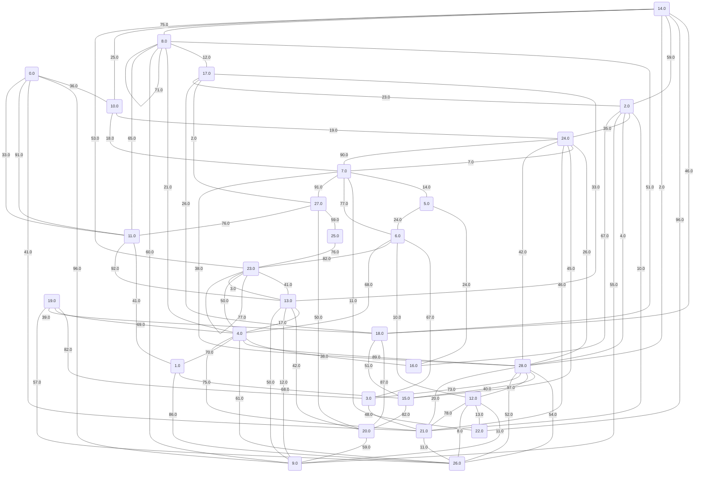

```mermaid
graph TD;
	0("0.0");
	1("1.0");
	2("2.0");
	3("3.0");
	4("4.0");
	5("5.0");
	6("6.0");
	7("7.0");
	8("8.0");
	9("9.0");
	10("10.0");
	11("11.0");
	12("12.0");
	13("13.0");
	14("14.0");
	15("15.0");
	16("16.0");
	17("17.0");
	18("18.0");
	19("19.0");
	20("20.0");
	21("21.0");
	22("22.0");
	23("23.0");
	24("24.0");
	25("25.0");
	26("26.0");
	27("27.0");
	28("28.0");
	15 -- "82.0" --- 20;
	6 -- "67.0" --- 3;
	12 -- "11.0" --- 9;
	13 -- "17.0" --- 4;
	11 -- "41.0" --- 1;
	11 -- "92.0" --- 13;
	5 -- "24.0" --- 16;
	9 -- "96.0" --- 0;
	7 -- "90.0" --- 24;
	7 -- "14.0" --- 5;
	20 -- "59.0" --- 9;
	27 -- "59.0" --- 25;
	4 -- "38.0" --- 16;
	28 -- "54.0" --- 26;
	14 -- "46.0" --- 18;
	4 -- "68.0" --- 6;
	18 -- "87.0" --- 20;
	8 -- "51.0" --- 18;
	2 -- "10.0" --- 21;
	8 -- "12.0" --- 17;
	7 -- "11.0" --- 22;
	1 -- "68.0" --- 15;
	2 -- "35.0" --- 24;
	27 -- "50.0" --- 20;
	14 -- "96.0" --- 22;
	2 -- "4.0" --- 28;
	17 -- "33.0" --- 13;
	7 -- "77.0" --- 6;
	12 -- "13.0" --- 22;
	7 -- "91.0" --- 27;
	19 -- "82.0" --- 3;
	0 -- "36.0" --- 10;
	27 -- "76.0" --- 11;
	21 -- "11.0" --- 26;
	4 -- "89.0" --- 28;
	7 -- "38.0" --- 28;
	6 -- "10.0" --- 12;
	28 -- "40.0" --- 15;
	21 -- "20.0" --- 28;
	17 -- "2.0" --- 27;
	4 -- "61.0" --- 26;
	24 -- "26.0" --- 28;
	1 -- "86.0" --- 26;
	3 -- "48.0" --- 21;
	23 -- "41.0" --- 13;
	10 -- "19.0" --- 24;
	8 -- "21.0" --- 4;
	13 -- "42.0" --- 20;
	11 -- "91.0" --- 0;
	23 -- "77.0" --- 23;
	6 -- "82.0" --- 23;
	4 -- "70.0" --- 1;
	14 -- "59.0" --- 2;
	23 -- "50.0" --- 4;
	21 -- "46.0" --- 24;
	12 -- "8.0" --- 26;
	13 -- "12.0" --- 9;
	2 -- "55.0" --- 9;
	19 -- "69.0" --- 4;
	17 -- "26.0" --- 18;
	24 -- "7.0" --- 7;
	5 -- "24.0" --- 6;
	14 -- "2.0" --- 28;
	14 -- "75.0" --- 8;
	28 -- "97.0" --- 12;
	28 -- "73.0" --- 3;
	23 -- "3.0" --- 13;
	14 -- "25.0" --- 10;
	11 -- "33.0" --- 0;
	8 -- "71.0" --- 8;
	25 -- "76.0" --- 23;
	17 -- "23.0" --- 2;
	12 -- "78.0" --- 21;
	13 -- "50.0" --- 9;
	2 -- "67.0" --- 16;
	19 -- "39.0" --- 18;
	19 -- "57.0" --- 26;
	4 -- "75.0" --- 21;
	28 -- "42.0" --- 24;
	14 -- "53.0" --- 23;
	28 -- "52.0" --- 26;
	18 -- "51.0" --- 15;
	24 -- "45.0" --- 15;
	21 -- "41.0" --- 0;
	8 -- "60.0" --- 9;
	10 -- "18.0" --- 7;
	8 -- "65.0" --- 11;
```

