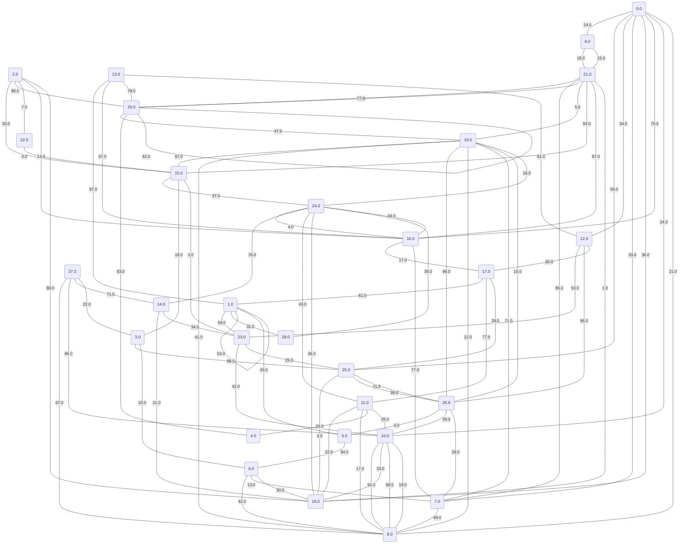

```mermaid
graph TD;
	0("0.0");
	1("1.0");
	2("2.0");
	3("3.0");
	4("4.0");
	5("5.0");
	6("6.0");
	7("7.0");
	8("8.0");
	9("9.0");
	10("10.0");
	11("11.0");
	12("12.0");
	13("13.0");
	14("14.0");
	15("15.0");
	16("16.0");
	17("17.0");
	18("18.0");
	19("19.0");
	20("20.0");
	21("21.0");
	22("22.0");
	23("23.0");
	24("24.0");
	25("25.0");
	26("26.0");
	27("27.0");
	28("28.0");
	2 -- "33.0" --- 15;
	18 -- "36.0" --- 24;
	18 -- "1.0" --- 21;
	1 -- "59.0" --- 23;
	11 -- "22.0" --- 18;
	10 -- "24.0" --- 0;
	20 -- "78.0" --- 21;
	13 -- "87.0" --- 1;
	2 -- "86.0" --- 20;
	17 -- "61.0" --- 1;
	9 -- "19.0" --- 10;
	6 -- "42.0" --- 9;
	11 -- "17.0" --- 9;
	6 -- "13.0" --- 7;
	2 -- "7.0" --- 22;
	9 -- "12.0" --- 19;
	17 -- "77.0" --- 11;
	20 -- "47.0" --- 19;
	7 -- "29.0" --- 26;
	27 -- "67.0" --- 9;
	1 -- "31.0" --- 28;
	28 -- "39.0" --- 24;
	16 -- "70.0" --- 0;
	27 -- "86.0" --- 10;
	13 -- "67.0" --- 16;
	24 -- "4.0" --- 16;
	19 -- "5.0" --- 21;
	17 -- "29.0" --- 25;
	23 -- "0.0" --- 15;
	0 -- "24.0" --- 8;
	16 -- "87.0" --- 21;
	16 -- "17.0" --- 17;
	14 -- "21.0" --- 18;
	7 -- "99.0" --- 9;
	25 -- "0.0" --- 18;
	12 -- "53.0" --- 23;
	0 -- "59.0" --- 25;
	20 -- "83.0" --- 4;
	20 -- "42.0" --- 20;
	6 -- "30.0" --- 18;
	13 -- "79.0" --- 20;
	13 -- "81.0" --- 12;
	22 -- "0.0" --- 15;
	19 -- "97.0" --- 15;
	10 -- "91.0" --- 9;
	26 -- "0.0" --- 5;
	8 -- "18.0" --- 21;
	15 -- "93.0" --- 21;
	23 -- "42.0" --- 10;
	12 -- "95.0" --- 26;
	26 -- "15.0" --- 19;
	16 -- "77.0" --- 7;
	10 -- "33.0" --- 18;
	19 -- "41.0" --- 9;
	24 -- "76.0" --- 14;
	5 -- "84.0" --- 6;
	21 -- "77.0" --- 20;
	0 -- "34.0" --- 12;
	0 -- "33.0" --- 7;
	1 -- "53.0" --- 1;
	27 -- "71.0" --- 14;
	11 -- "20.0" --- 4;
	5 -- "43.0" --- 1;
	12 -- "35.0" --- 17;
	2 -- "14.0" --- 16;
	7 -- "71.0" --- 19;
	27 -- "22.0" --- 3;
	21 -- "85.0" --- 7;
	24 -- "16.0" --- 19;
	8 -- "15.0" --- 21;
	2 -- "88.0" --- 18;
	19 -- "96.0" --- 26;
	0 -- "36.0" --- 18;
	3 -- "88.0" --- 25;
	14 -- "34.0" --- 23;
	11 -- "25.0" --- 10;
	23 -- "25.0" --- 25;
	9 -- "21.0" --- 0;
	3 -- "10.0" --- 6;
	10 -- "89.0" --- 9;
	15 -- "37.0" --- 24;
	15 -- "18.0" --- 3;
	24 -- "43.0" --- 11;
	26 -- "71.0" --- 25;
	26 -- "56.0" --- 10;
	25 -- "38.0" --- 26;
	16 -- "34.0" --- 24;
```

