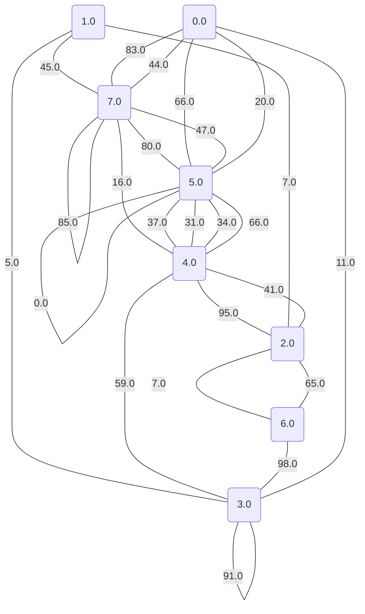

```mermaid
graph TD;
	0("0.0");
	1("1.0");
	2("2.0");
	3("3.0");
	4("4.0");
	5("5.0");
	6("6.0");
	7("7.0");
	2 -- "7.0" --- 6;
	2 -- "41.0" --- 4;
	6 -- "65.0" --- 2;
	5 -- "20.0" --- 0;
	5 -- "0.0" --- 5;
	1 -- "5.0" --- 3;
	1 -- "45.0" --- 7;
	7 -- "80.0" --- 5;
	0 -- "66.0" --- 5;
	7 -- "85.0" --- 7;
	3 -- "11.0" --- 0;
	4 -- "34.0" --- 5;
	4 -- "59.0" --- 3;
	7 -- "16.0" --- 4;
	4 -- "95.0" --- 2;
	7 -- "47.0" --- 5;
	5 -- "37.0" --- 4;
	5 -- "31.0" --- 4;
	0 -- "83.0" --- 7;
	3 -- "91.0" --- 3;
	1 -- "7.0" --- 2;
	0 -- "44.0" --- 7;
	4 -- "66.0" --- 5;
	6 -- "98.0" --- 3;
```

