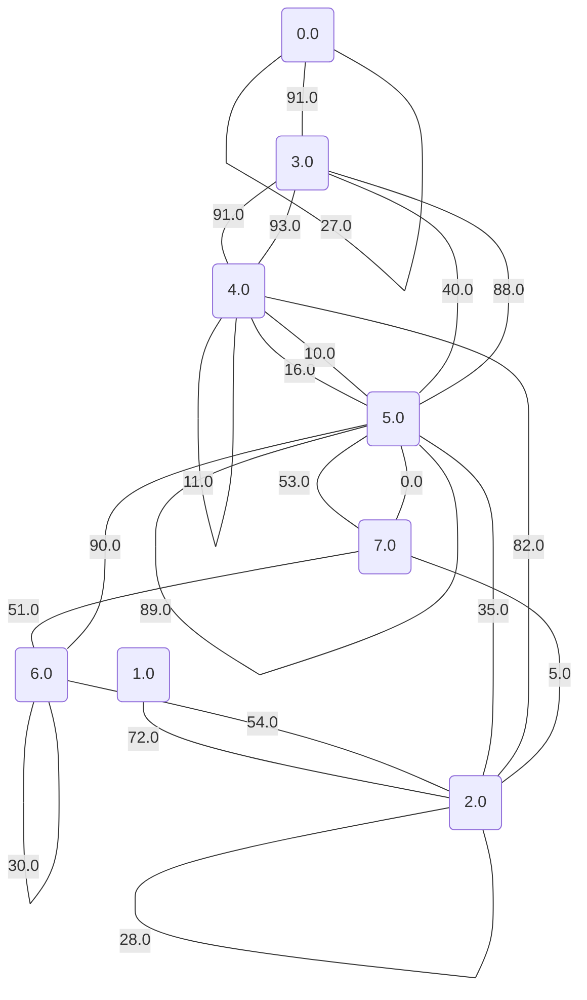

```mermaid
graph TD;
	0("0.0");
	1("1.0");
	2("2.0");
	3("3.0");
	4("4.0");
	5("5.0");
	6("6.0");
	7("7.0");
	5 -- "26.0" --- 5;
	1 -- "72.0" --- 2;
	0 -- "91.0" --- 3;
	0 -- "27.0" --- 0;
	3 -- "91.0" --- 4;
	6 -- "30.0" --- 6;
	6 -- "90.0" --- 5;
	5 -- "89.0" --- 5;
	5 -- "40.0" --- 3;
	4 -- "75.0" --- 4;
	6 -- "54.0" --- 2;
	4 -- "11.0" --- 4;
	4 -- "16.0" --- 5;
	5 -- "35.0" --- 2;
	4 -- "82.0" --- 2;
	7 -- "5.0" --- 2;
	5 -- "88.0" --- 3;
	4 -- "93.0" --- 3;
	2 -- "48.0" --- 2;
	5 -- "53.0" --- 7;
	5 -- "0.0" --- 7;
	2 -- "28.0" --- 2;
	4 -- "10.0" --- 5;
	7 -- "51.0" --- 6;
```

