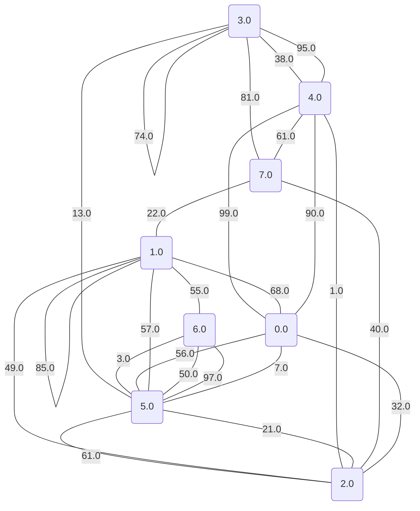

```mermaid
graph TD;
	0("0.0");
	1("1.0");
	2("2.0");
	3("3.0");
	4("4.0");
	5("5.0");
	6("6.0");
	7("7.0");
	3 -- "81.0" --- 7;
	3 -- "13.0" --- 5;
	3 -- "38.0" --- 4;
	6 -- "3.0" --- 5;
	7 -- "22.0" --- 1;
	4 -- "99.0" --- 0;
	2 -- "32.0" --- 0;
	3 -- "74.0" --- 3;
	0 -- "56.0" --- 5;
	4 -- "95.0" --- 3;
	1 -- "55.0" --- 6;
	5 -- "7.0" --- 0;
	5 -- "61.0" --- 2;
	1 -- "49.0" --- 2;
	1 -- "57.0" --- 5;
	4 -- "61.0" --- 7;
	4 -- "1.0" --- 2;
	1 -- "85.0" --- 1;
	1 -- "68.0" --- 0;
	6 -- "50.0" --- 5;
	5 -- "21.0" --- 2;
	6 -- "97.0" --- 5;
	4 -- "90.0" --- 0;
	7 -- "40.0" --- 2;
```

