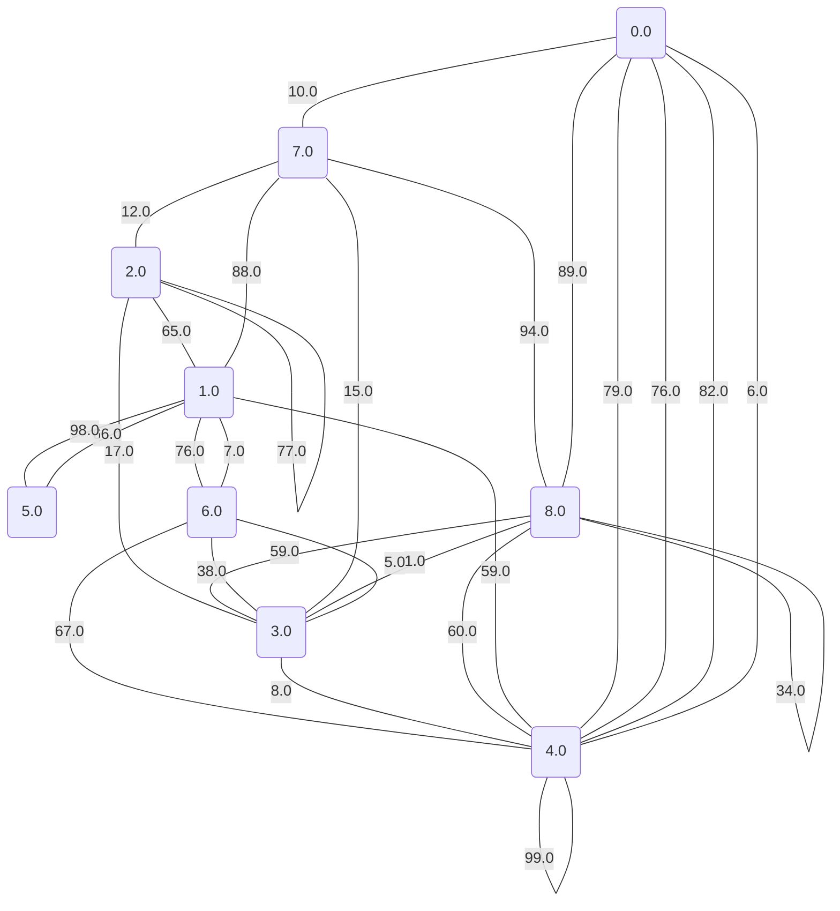

```mermaid
graph TD;
	0("0.0");
	1("1.0");
	2("2.0");
	3("3.0");
	4("4.0");
	5("5.0");
	6("6.0");
	7("7.0");
	8("8.0");
	2 -- "17.0" --- 3;
	1 -- "88.0" --- 7;
	1 -- "76.0" --- 6;
	6 -- "67.0" --- 4;
	5 -- "66.0" --- 1;
	0 -- "10.0" --- 7;
	2 -- "65.0" --- 1;
	8 -- "59.0" --- 3;
	3 -- "8.0" --- 4;
	6 -- "38.0" --- 3;
	4 -- "76.0" --- 0;
	2 -- "77.0" --- 2;
	6 -- "7.0" --- 1;
	4 -- "82.0" --- 0;
	8 -- "34.0" --- 8;
	8 -- "60.0" --- 4;
	7 -- "15.0" --- 3;
	7 -- "94.0" --- 8;
	8 -- "1.0" --- 3;
	1 -- "98.0" --- 5;
	7 -- "12.0" --- 2;
	1 -- "59.0" --- 4;
	4 -- "6.0" --- 0;
	6 -- "5.0" --- 3;
	0 -- "79.0" --- 4;
	0 -- "89.0" --- 8;
	4 -- "99.0" --- 4;
```

