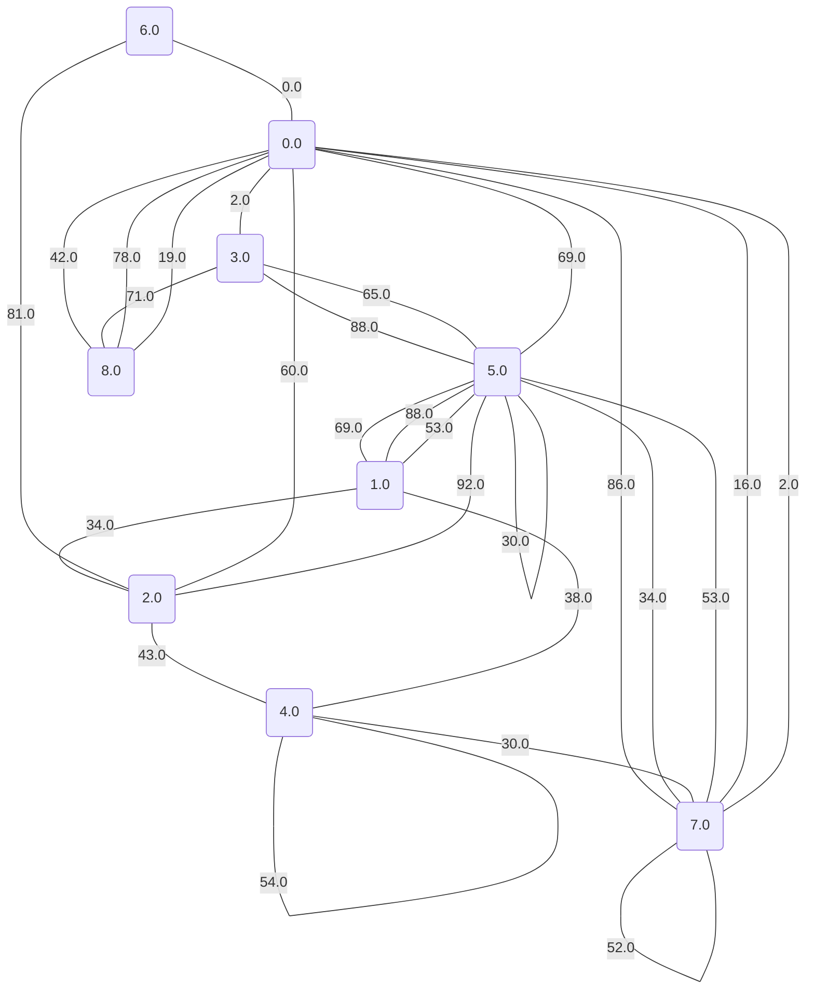

```mermaid
graph TD;
	0("0.0");
	1("1.0");
	2("2.0");
	3("3.0");
	4("4.0");
	5("5.0");
	6("6.0");
	7("7.0");
	8("8.0");
	0 -- "86.0" --- 7;
	5 -- "30.0" --- 5;
	5 -- "34.0" --- 7;
	0 -- "2.0" --- 3;
	1 -- "88.0" --- 5;
	4 -- "30.0" --- 7;
	6 -- "0.0" --- 0;
	2 -- "43.0" --- 4;
	7 -- "2.0" --- 0;
	1 -- "34.0" --- 2;
	4 -- "54.0" --- 4;
	8 -- "78.0" --- 0;
	5 -- "69.0" --- 1;
	0 -- "42.0" --- 8;
	5 -- "53.0" --- 7;
	5 -- "65.0" --- 3;
	1 -- "53.0" --- 5;
	0 -- "16.0" --- 7;
	8 -- "19.0" --- 0;
	2 -- "60.0" --- 0;
	5 -- "69.0" --- 0;
	1 -- "38.0" --- 4;
	6 -- "81.0" --- 2;
	3 -- "88.0" --- 5;
	7 -- "52.0" --- 7;
	2 -- "92.0" --- 5;
	3 -- "71.0" --- 8;
```

