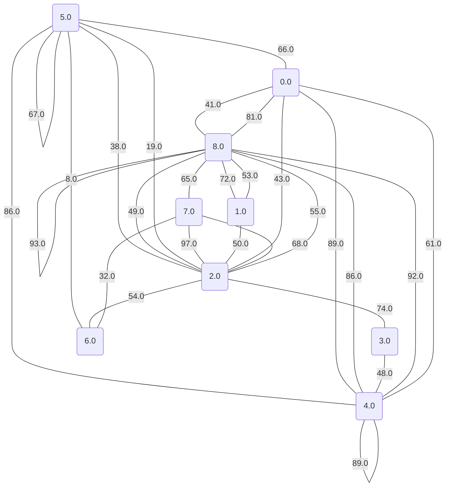

```mermaid
graph TD;
	0("0.0");
	1("1.0");
	2("2.0");
	3("3.0");
	4("4.0");
	5("5.0");
	6("6.0");
	7("7.0");
	8("8.0");
	8 -- "65.0" --- 7;
	5 -- "38.0" --- 2;
	4 -- "92.0" --- 8;
	8 -- "72.0" --- 1;
	2 -- "68.0" --- 7;
	8 -- "49.0" --- 2;
	2 -- "74.0" --- 3;
	8 -- "81.0" --- 0;
	4 -- "89.0" --- 4;
	5 -- "19.0" --- 2;
	7 -- "97.0" --- 2;
	5 -- "86.0" --- 4;
	6 -- "32.0" --- 7;
	8 -- "93.0" --- 8;
	0 -- "41.0" --- 8;
	5 -- "66.0" --- 0;
	0 -- "89.0" --- 4;
	1 -- "50.0" --- 2;
	4 -- "61.0" --- 0;
	5 -- "67.0" --- 5;
	1 -- "53.0" --- 8;
	2 -- "55.0" --- 8;
	8 -- "86.0" --- 4;
	3 -- "48.0" --- 4;
	5 -- "8.0" --- 6;
	2 -- "54.0" --- 6;
	0 -- "43.0" --- 2;
```

