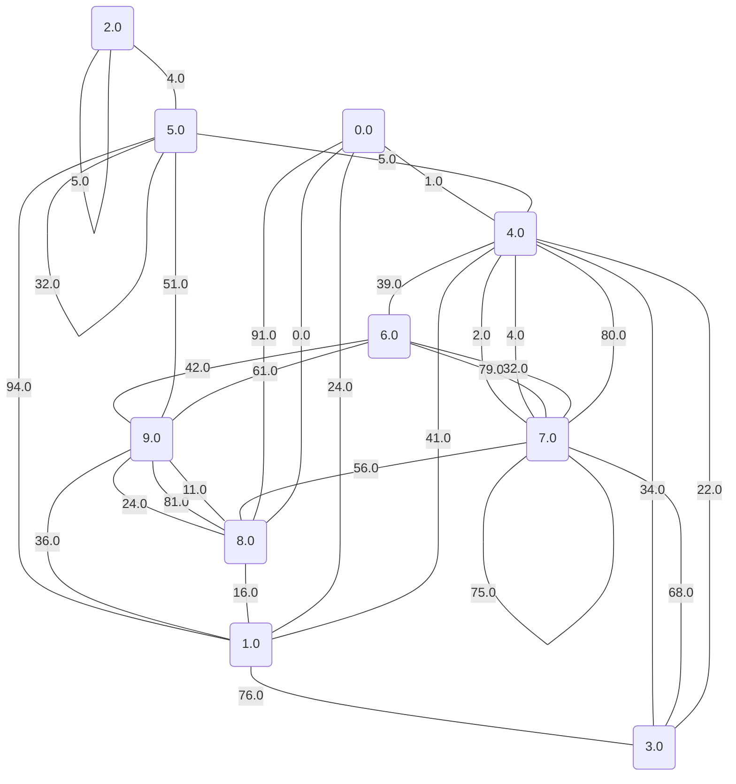

```mermaid
graph TD;
	0("0.0");
	1("1.0");
	2("2.0");
	3("3.0");
	4("4.0");
	5("5.0");
	6("6.0");
	7("7.0");
	8("8.0");
	9("9.0");
	9 -- "61.0" --- 6;
	1 -- "76.0" --- 3;
	5 -- "94.0" --- 1;
	9 -- "24.0" --- 8;
	9 -- "36.0" --- 1;
	6 -- "42.0" --- 9;
	9 -- "81.0" --- 8;
	1 -- "24.0" --- 0;
	4 -- "2.0" --- 7;
	4 -- "4.0" --- 7;
	4 -- "34.0" --- 3;
	7 -- "75.0" --- 7;
	6 -- "79.0" --- 7;
	3 -- "22.0" --- 4;
	4 -- "39.0" --- 6;
	8 -- "91.0" --- 0;
	1 -- "41.0" --- 4;
	7 -- "80.0" --- 4;
	0 -- "1.0" --- 4;
	5 -- "32.0" --- 5;
	9 -- "11.0" --- 8;
	6 -- "32.0" --- 7;
	8 -- "16.0" --- 1;
	5 -- "5.0" --- 4;
	2 -- "5.0" --- 2;
	2 -- "4.0" --- 5;
	7 -- "56.0" --- 8;
	8 -- "0.0" --- 0;
	7 -- "68.0" --- 3;
	5 -- "51.0" --- 9;
```

