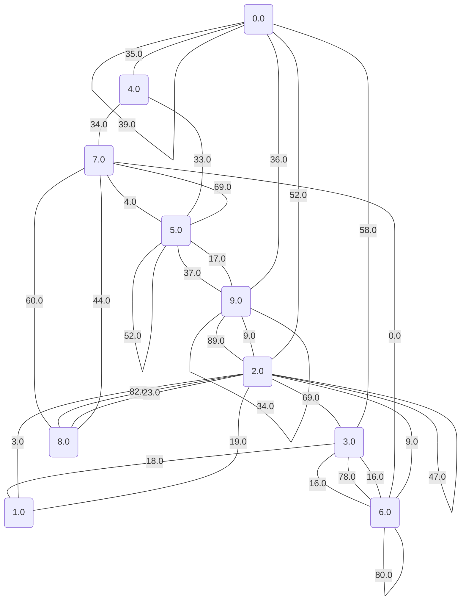

```mermaid
graph TD;
	0("0.0");
	1("1.0");
	2("2.0");
	3("3.0");
	4("4.0");
	5("5.0");
	6("6.0");
	7("7.0");
	8("8.0");
	9("9.0");
	3 -- "16.0" --- 6;
	0 -- "35.0" --- 4;
	7 -- "60.0" --- 8;
	9 -- "89.0" --- 2;
	2 -- "82.0" --- 8;
	4 -- "34.0" --- 7;
	5 -- "33.0" --- 4;
	2 -- "69.0" --- 3;
	6 -- "0.0" --- 7;
	6 -- "9.0" --- 2;
	3 -- "18.0" --- 1;
	5 -- "37.0" --- 9;
	5 -- "17.0" --- 9;
	3 -- "78.0" --- 6;
	3 -- "58.0" --- 0;
	2 -- "23.0" --- 8;
	2 -- "47.0" --- 2;
	1 -- "3.0" --- 2;
	9 -- "9.0" --- 2;
	0 -- "39.0" --- 0;
	1 -- "19.0" --- 2;
	9 -- "36.0" --- 0;
	3 -- "16.0" --- 6;
	9 -- "34.0" --- 9;
	5 -- "52.0" --- 5;
	5 -- "69.0" --- 7;
	7 -- "44.0" --- 8;
	6 -- "80.0" --- 6;
	7 -- "4.0" --- 5;
	2 -- "52.0" --- 0;
```

