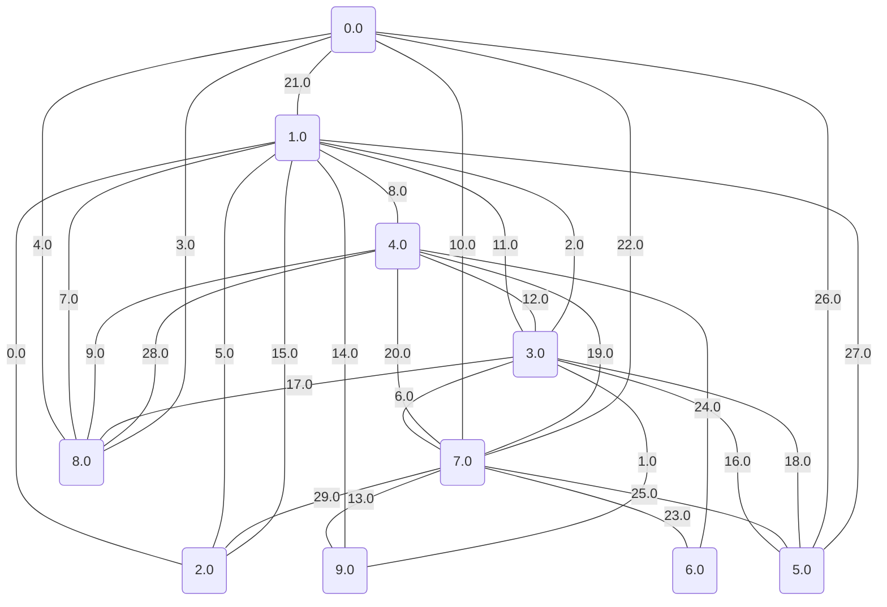

```mermaid
graph TD;
0("0.0");
1("1.0");
2("2.0");
3("3.0");
4("4.0");
5("5.0");
6("6.0");
7("7.0");
8("8.0");
9("9.0");
	1 -- "0.0" --- 2;
	9 -- "1.0" --- 3;
	3 -- "2.0" --- 1;
	8 -- "3.0" --- 0;
	0 -- "4.0" --- 8;
	1 -- "5.0" --- 2;
	3 -- "6.0" --- 7;
	1 -- "7.0" --- 8;
	1 -- "8.0" --- 4;
	4 -- "9.0" --- 8;
	7 -- "10.0" --- 0;
	1 -- "11.0" --- 3;
	4 -- "12.0" --- 3;
	7 -- "13.0" --- 9;
	1 -- "14.0" --- 9;
	2 -- "15.0" --- 1;
	3 -- "16.0" --- 5;
	3 -- "17.0" --- 8;
	5 -- "18.0" --- 3;
	7 -- "19.0" --- 4;
	4 -- "20.0" --- 7;
	0 -- "21.0" --- 1;
	7 -- "22.0" --- 0;
	7 -- "23.0" --- 6;
	4 -- "24.0" --- 6;
	7 -- "25.0" --- 5;
	5 -- "26.0" --- 0;
	5 -- "27.0" --- 1;
	4 -- "28.0" --- 8;
	7 -- "29.0" --- 2;
```
