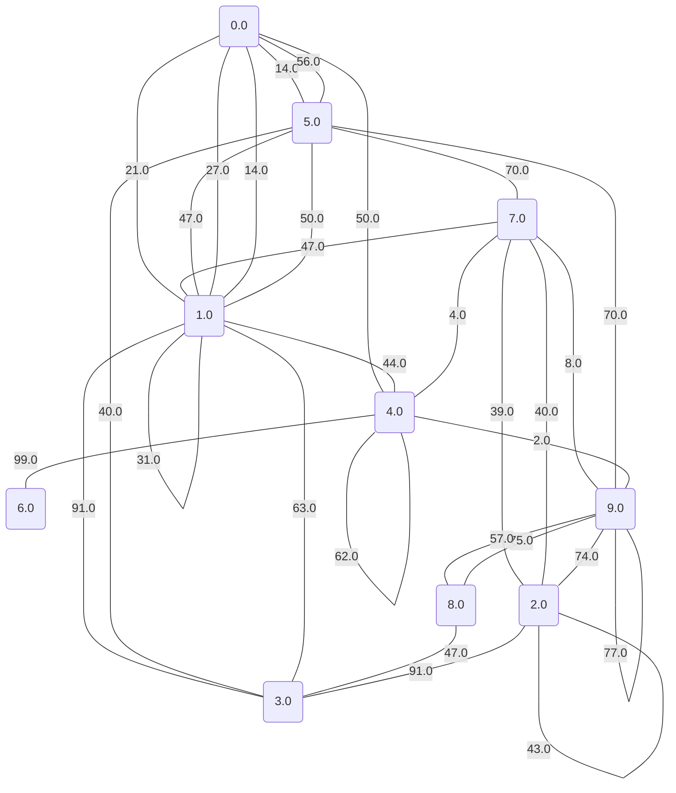

```mermaid
graph TD;
	0("0.0");
	1("1.0");
	2("2.0");
	3("3.0");
	4("4.0");
	5("5.0");
	6("6.0");
	7("7.0");
	8("8.0");
	9("9.0");
	0 -- "14.0" --- 5;
	7 -- "8.0" --- 9;
	1 -- "91.0" --- 3;
	5 -- "70.0" --- 9;
	7 -- "39.0" --- 2;
	1 -- "47.0" --- 5;
	0 -- "50.0" --- 4;
	1 -- "44.0" --- 4;
	5 -- "70.0" --- 7;
	8 -- "75.0" --- 9;
	4 -- "99.0" --- 6;
	1 -- "27.0" --- 0;
	2 -- "43.0" --- 2;
	5 -- "56.0" --- 0;
	7 -- "40.0" --- 2;
	5 -- "40.0" --- 3;
	4 -- "4.0" --- 7;
	9 -- "77.0" --- 9;
	1 -- "14.0" --- 0;
	1 -- "50.0" --- 5;
	9 -- "74.0" --- 2;
	1 -- "63.0" --- 3;
	4 -- "62.0" --- 4;
	1 -- "31.0" --- 1;
	0 -- "21.0" --- 1;
	8 -- "47.0" --- 3;
	2 -- "91.0" --- 3;
	9 -- "57.0" --- 8;
	7 -- "47.0" --- 1;
	4 -- "2.0" --- 9;
```

