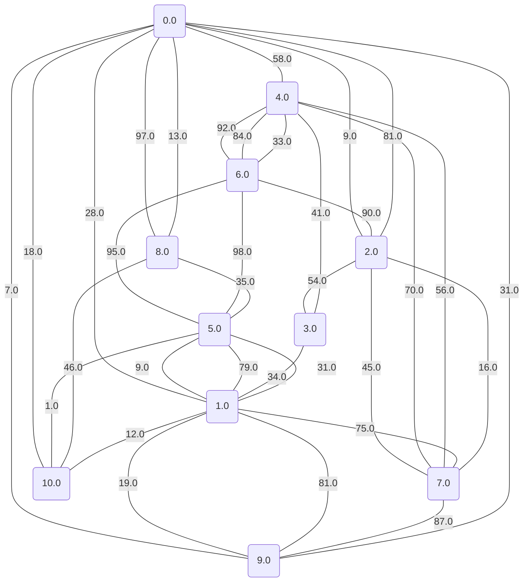

```mermaid
graph TD;
	0("0.0");
	1("1.0");
	2("2.0");
	3("3.0");
	4("4.0");
	5("5.0");
	6("6.0");
	7("7.0");
	8("8.0");
	9("9.0");
	10("10.0");
	2 -- "16.0" --- 7;
	0 -- "13.0" --- 8;
	8 -- "97.0" --- 0;
	2 -- "9.0" --- 0;
	4 -- "33.0" --- 6;
	1 -- "12.0" --- 10;
	5 -- "31.0" --- 1;
	8 -- "35.0" --- 5;
	6 -- "92.0" --- 4;
	3 -- "34.0" --- 1;
	1 -- "75.0" --- 7;
	0 -- "31.0" --- 9;
	6 -- "98.0" --- 5;
	9 -- "81.0" --- 1;
	4 -- "56.0" --- 7;
	0 -- "81.0" --- 2;
	4 -- "70.0" --- 7;
	6 -- "95.0" --- 5;
	5 -- "79.0" --- 1;
	9 -- "19.0" --- 1;
	0 -- "58.0" --- 4;
	7 -- "87.0" --- 9;
	1 -- "28.0" --- 0;
	10 -- "1.0" --- 5;
	5 -- "9.0" --- 1;
	4 -- "41.0" --- 3;
	4 -- "84.0" --- 6;
	2 -- "54.0" --- 3;
	8 -- "46.0" --- 10;
	9 -- "7.0" --- 0;
	2 -- "45.0" --- 7;
	6 -- "90.0" --- 2;
	10 -- "18.0" --- 0;
```

