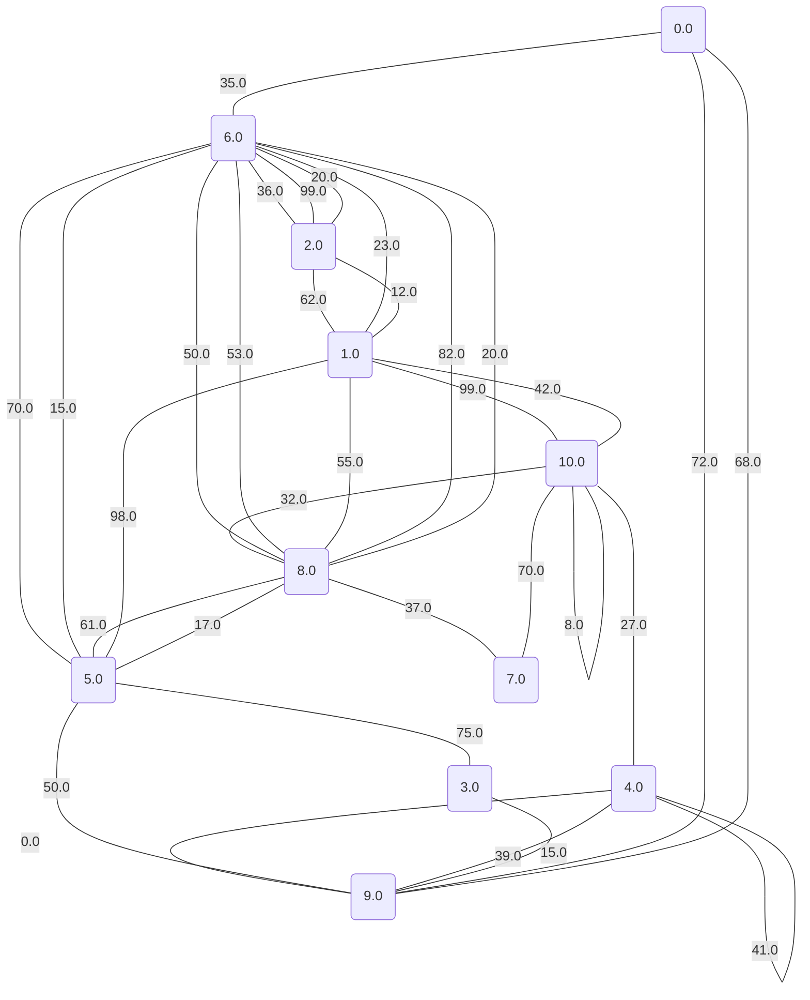

```mermaid
graph TD;
	0("0.0");
	1("1.0");
	2("2.0");
	3("3.0");
	4("4.0");
	5("5.0");
	6("6.0");
	7("7.0");
	8("8.0");
	9("9.0");
	10("10.0");
	6 -- "36.0" --- 2;
	5 -- "98.0" --- 1;
	1 -- "99.0" --- 10;
	6 -- "70.0" --- 5;
	10 -- "32.0" --- 8;
	2 -- "62.0" --- 1;
	8 -- "53.0" --- 6;
	4 -- "0.0" --- 9;
	10 -- "27.0" --- 4;
	6 -- "15.0" --- 5;
	0 -- "35.0" --- 6;
	4 -- "41.0" --- 4;
	5 -- "50.0" --- 9;
	5 -- "17.0" --- 8;
	2 -- "20.0" --- 6;
	1 -- "12.0" --- 2;
	1 -- "42.0" --- 10;
	10 -- "83.0" --- 10;
	9 -- "72.0" --- 0;
	10 -- "8.0" --- 10;
	8 -- "61.0" --- 5;
	6 -- "99.0" --- 2;
	4 -- "39.0" --- 9;
	5 -- "75.0" --- 3;
	6 -- "50.0" --- 8;
	6 -- "23.0" --- 1;
	8 -- "55.0" --- 1;
	3 -- "15.0" --- 9;
	7 -- "70.0" --- 10;
	8 -- "82.0" --- 6;
	8 -- "37.0" --- 7;
	9 -- "68.0" --- 0;
	8 -- "20.0" --- 6;
```

