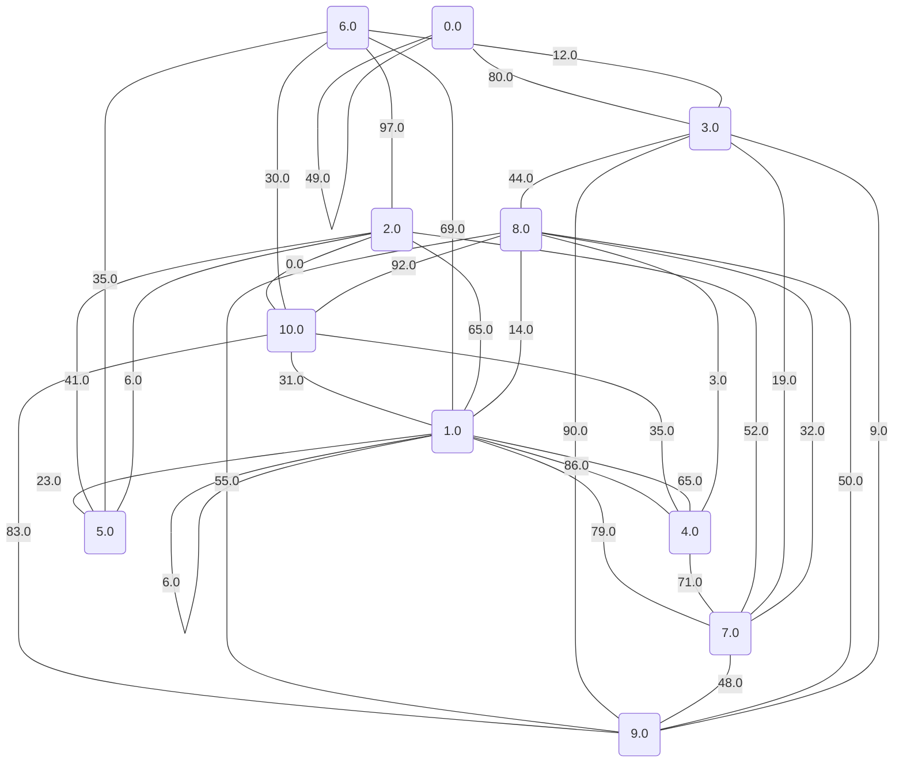

```mermaid
graph TD;
	0("0.0");
	1("1.0");
	2("2.0");
	3("3.0");
	4("4.0");
	5("5.0");
	6("6.0");
	7("7.0");
	8("8.0");
	9("9.0");
	10("10.0");
	4 -- "35.0" --- 10;
	1 -- "86.0" --- 4;
	7 -- "19.0" --- 3;
	4 -- "65.0" --- 1;
	1 -- "14.0" --- 8;
	10 -- "83.0" --- 9;
	3 -- "44.0" --- 8;
	1 -- "79.0" --- 7;
	9 -- "9.0" --- 3;
	4 -- "71.0" --- 7;
	1 -- "23.0" --- 5;
	0 -- "80.0" --- 3;
	0 -- "49.0" --- 0;
	2 -- "41.0" --- 5;
	6 -- "35.0" --- 5;
	7 -- "32.0" --- 8;
	8 -- "55.0" --- 9;
	2 -- "6.0" --- 5;
	2 -- "0.0" --- 10;
	4 -- "3.0" --- 8;
	1 -- "40.0" --- 1;
	6 -- "30.0" --- 10;
	6 -- "12.0" --- 3;
	3 -- "90.0" --- 9;
	10 -- "31.0" --- 1;
	7 -- "48.0" --- 9;
	6 -- "69.0" --- 1;
	2 -- "52.0" --- 7;
	8 -- "50.0" --- 9;
	2 -- "65.0" --- 1;
	1 -- "6.0" --- 1;
	6 -- "97.0" --- 2;
	8 -- "92.0" --- 10;
```

