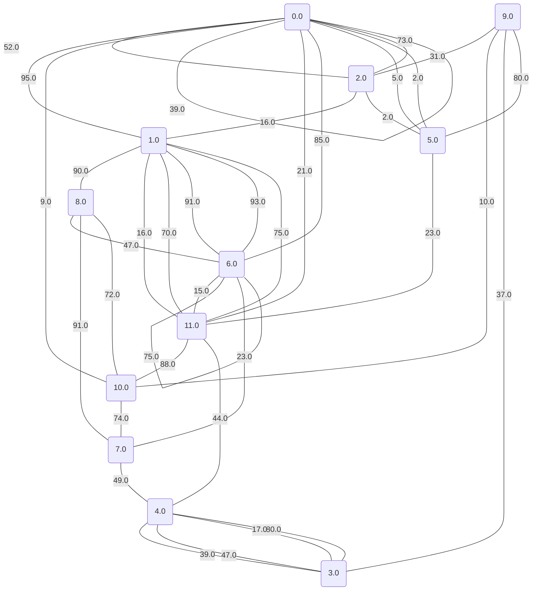

```mermaid
graph TD;
	0("0.0");
	1("1.0");
	2("2.0");
	3("3.0");
	4("4.0");
	5("5.0");
	6("6.0");
	7("7.0");
	8("8.0");
	9("9.0");
	10("10.0");
	11("11.0");
	10 -- "72.0" --- 8;
	7 -- "23.0" --- 6;
	11 -- "88.0" --- 10;
	11 -- "21.0" --- 0;
	11 -- "75.0" --- 1;
	4 -- "39.0" --- 3;
	4 -- "47.0" --- 3;
	0 -- "52.0" --- 2;
	6 -- "15.0" --- 11;
	9 -- "31.0" --- 2;
	9 -- "10.0" --- 10;
	1 -- "90.0" --- 8;
	8 -- "47.0" --- 6;
	2 -- "16.0" --- 1;
	3 -- "80.0" --- 4;
	0 -- "95.0" --- 1;
	5 -- "5.0" --- 0;
	1 -- "16.0" --- 11;
	0 -- "9.0" --- 10;
	8 -- "91.0" --- 7;
	6 -- "85.0" --- 0;
	1 -- "70.0" --- 11;
	0 -- "39.0" --- 0;
	9 -- "37.0" --- 3;
	4 -- "17.0" --- 3;
	5 -- "2.0" --- 0;
	2 -- "2.0" --- 5;
	1 -- "91.0" --- 6;
	9 -- "80.0" --- 5;
	2 -- "73.0" --- 0;
	10 -- "74.0" --- 7;
	7 -- "49.0" --- 4;
	6 -- "75.0" --- 6;
	4 -- "44.0" --- 11;
	5 -- "23.0" --- 11;
	1 -- "93.0" --- 6;
```

