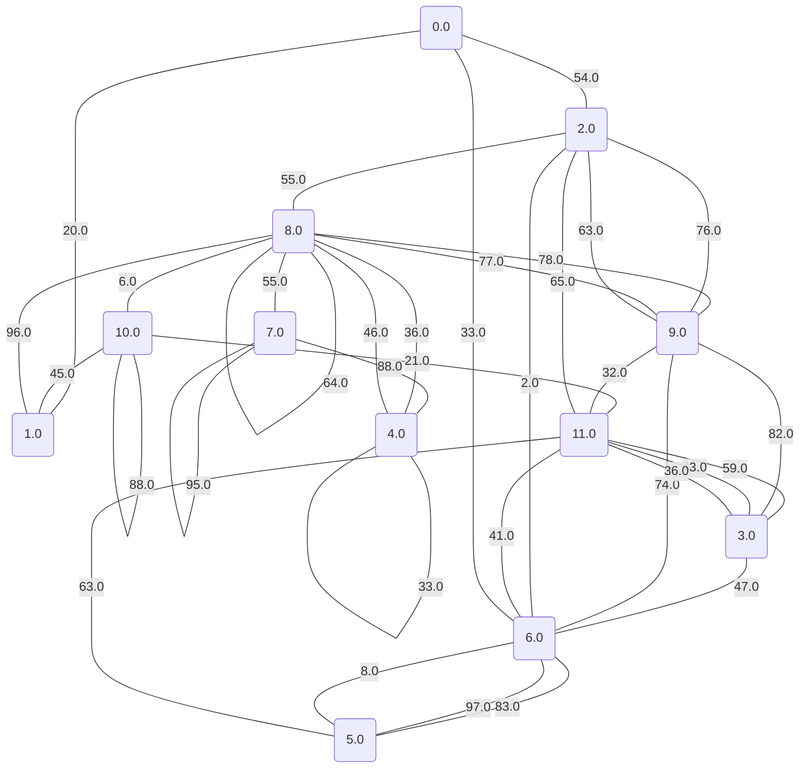

```mermaid
graph TD;
	0("0.0");
	1("1.0");
	2("2.0");
	3("3.0");
	4("4.0");
	5("5.0");
	6("6.0");
	7("7.0");
	8("8.0");
	9("9.0");
	10("10.0");
	11("11.0");
	8 -- "55.0" --- 7;
	6 -- "83.0" --- 5;
	10 -- "88.0" --- 10;
	7 -- "88.0" --- 4;
	6 -- "74.0" --- 9;
	0 -- "54.0" --- 2;
	11 -- "59.0" --- 3;
	7 -- "95.0" --- 7;
	9 -- "63.0" --- 2;
	2 -- "55.0" --- 8;
	6 -- "2.0" --- 2;
	10 -- "21.0" --- 11;
	0 -- "20.0" --- 1;
	4 -- "46.0" --- 8;
	9 -- "32.0" --- 11;
	9 -- "82.0" --- 3;
	8 -- "78.0" --- 9;
	8 -- "36.0" --- 4;
	4 -- "33.0" --- 4;
	8 -- "6.0" --- 10;
	8 -- "68.0" --- 8;
	6 -- "97.0" --- 5;
	2 -- "76.0" --- 9;
	8 -- "77.0" --- 9;
	6 -- "8.0" --- 5;
	3 -- "47.0" --- 6;
	5 -- "63.0" --- 11;
	11 -- "65.0" --- 2;
	10 -- "45.0" --- 1;
	3 -- "43.0" --- 11;
	3 -- "36.0" --- 11;
	6 -- "41.0" --- 11;
	6 -- "33.0" --- 0;
	8 -- "96.0" --- 1;
	8 -- "7.0" --- 8;
	8 -- "64.0" --- 8;
```

