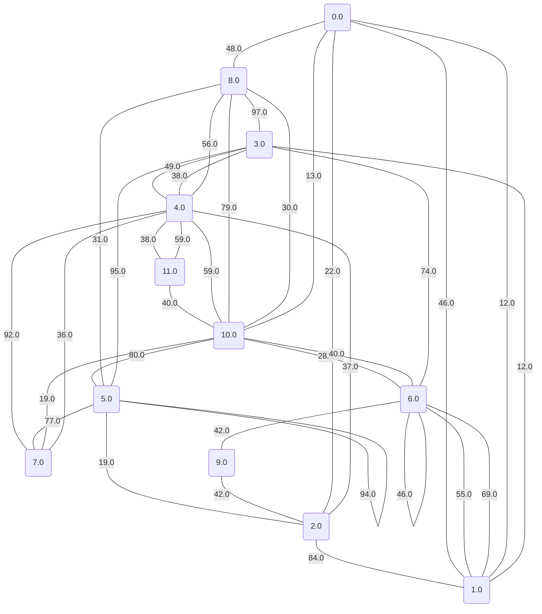

```mermaid
graph TD;
	0("0.0");
	1("1.0");
	2("2.0");
	3("3.0");
	4("4.0");
	5("5.0");
	6("6.0");
	7("7.0");
	8("8.0");
	9("9.0");
	10("10.0");
	11("11.0");
	10 -- "80.0" --- 5;
	2 -- "84.0" --- 1;
	10 -- "59.0" --- 4;
	0 -- "48.0" --- 8;
	7 -- "36.0" --- 4;
	5 -- "94.0" --- 5;
	10 -- "28.0" --- 6;
	1 -- "12.0" --- 0;
	3 -- "49.0" --- 4;
	10 -- "79.0" --- 8;
	0 -- "46.0" --- 1;
	5 -- "19.0" --- 2;
	5 -- "31.0" --- 8;
	6 -- "74.0" --- 3;
	4 -- "92.0" --- 7;
	5 -- "77.0" --- 7;
	6 -- "42.0" --- 9;
	9 -- "42.0" --- 2;
	11 -- "40.0" --- 10;
	0 -- "22.0" --- 2;
	5 -- "95.0" --- 3;
	11 -- "59.0" --- 4;
	10 -- "19.0" --- 7;
	10 -- "30.0" --- 8;
	3 -- "38.0" --- 4;
	6 -- "63.0" --- 6;
	6 -- "55.0" --- 1;
	10 -- "40.0" --- 6;
	6 -- "46.0" --- 6;
	10 -- "13.0" --- 0;
	6 -- "69.0" --- 1;
	4 -- "38.0" --- 11;
	2 -- "37.0" --- 4;
	1 -- "12.0" --- 3;
	8 -- "97.0" --- 3;
	8 -- "56.0" --- 4;
```

