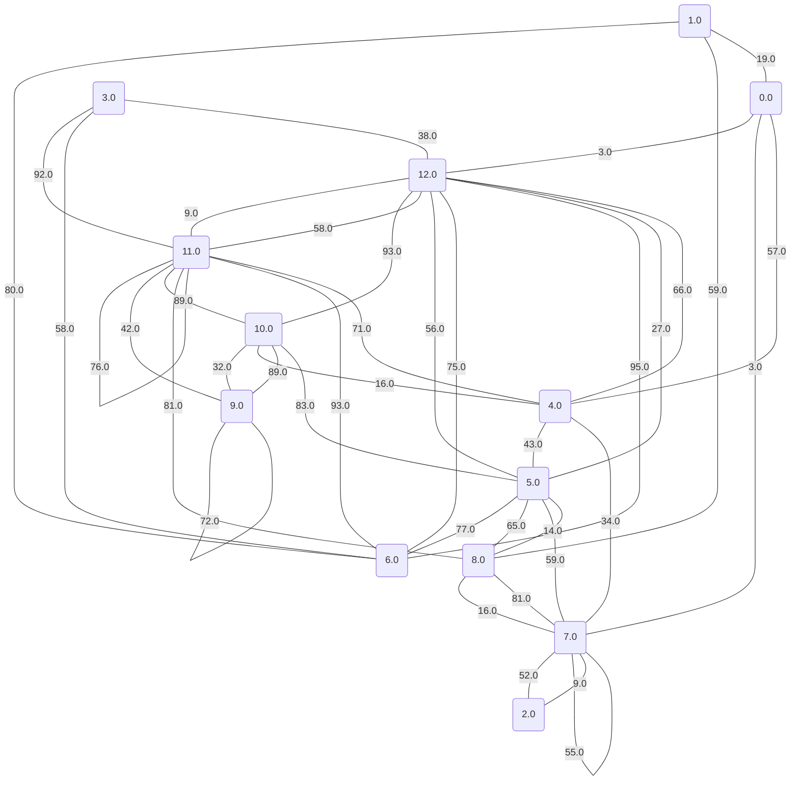

```mermaid
graph TD;
	0("0.0");
	1("1.0");
	2("2.0");
	3("3.0");
	4("4.0");
	5("5.0");
	6("6.0");
	7("7.0");
	8("8.0");
	9("9.0");
	10("10.0");
	11("11.0");
	12("12.0");
	4 -- "43.0" --- 5;
	10 -- "32.0" --- 9;
	5 -- "56.0" --- 12;
	5 -- "77.0" --- 6;
	3 -- "92.0" --- 11;
	6 -- "75.0" --- 12;
	9 -- "72.0" --- 9;
	10 -- "16.0" --- 4;
	1 -- "80.0" --- 6;
	5 -- "27.0" --- 12;
	7 -- "81.0" --- 8;
	4 -- "71.0" --- 11;
	0 -- "3.0" --- 12;
	5 -- "65.0" --- 8;
	11 -- "76.0" --- 11;
	7 -- "52.0" --- 2;
	5 -- "59.0" --- 7;
	6 -- "93.0" --- 11;
	4 -- "66.0" --- 12;
	12 -- "9.0" --- 11;
	6 -- "95.0" --- 12;
	7 -- "3.0" --- 0;
	3 -- "58.0" --- 6;
	7 -- "55.0" --- 7;
	2 -- "9.0" --- 7;
	3 -- "38.0" --- 12;
	11 -- "42.0" --- 9;
	1 -- "59.0" --- 8;
	4 -- "57.0" --- 0;
	5 -- "14.0" --- 8;
	7 -- "34.0" --- 4;
	1 -- "19.0" --- 0;
	5 -- "83.0" --- 10;
	12 -- "93.0" --- 10;
	11 -- "89.0" --- 10;
	8 -- "16.0" --- 7;
	11 -- "81.0" --- 8;
	12 -- "58.0" --- 11;
	10 -- "89.0" --- 9;
```

