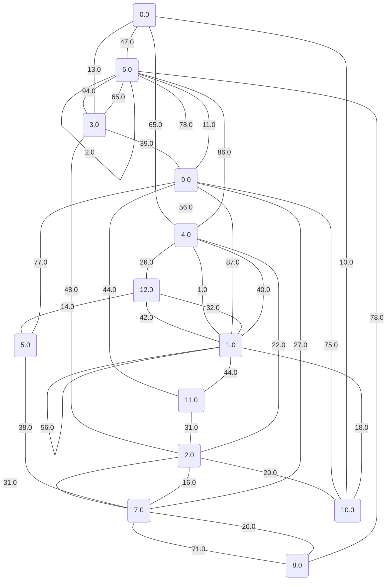

```mermaid
graph TD;
	0("0.0");
	1("1.0");
	2("2.0");
	3("3.0");
	4("4.0");
	5("5.0");
	6("6.0");
	7("7.0");
	8("8.0");
	9("9.0");
	10("10.0");
	11("11.0");
	12("12.0");
	3 -- "39.0" --- 9;
	3 -- "65.0" --- 6;
	7 -- "71.0" --- 8;
	6 -- "82.0" --- 6;
	12 -- "42.0" --- 1;
	2 -- "20.0" --- 10;
	1 -- "83.0" --- 1;
	0 -- "47.0" --- 6;
	3 -- "48.0" --- 2;
	0 -- "65.0" --- 4;
	7 -- "26.0" --- 8;
	9 -- "11.0" --- 6;
	1 -- "56.0" --- 1;
	6 -- "94.0" --- 3;
	2 -- "31.0" --- 7;
	10 -- "75.0" --- 9;
	6 -- "78.0" --- 9;
	9 -- "56.0" --- 4;
	1 -- "32.0" --- 12;
	9 -- "44.0" --- 11;
	6 -- "27.0" --- 6;
	1 -- "40.0" --- 4;
	10 -- "10.0" --- 0;
	1 -- "44.0" --- 11;
	11 -- "31.0" --- 2;
	5 -- "38.0" --- 7;
	2 -- "22.0" --- 4;
	6 -- "2.0" --- 6;
	0 -- "13.0" --- 3;
	6 -- "86.0" --- 4;
	4 -- "26.0" --- 12;
	7 -- "16.0" --- 2;
	4 -- "1.0" --- 1;
	12 -- "14.0" --- 5;
	9 -- "87.0" --- 1;
	5 -- "77.0" --- 9;
	7 -- "27.0" --- 9;
	8 -- "78.0" --- 6;
	10 -- "18.0" --- 1;
```

