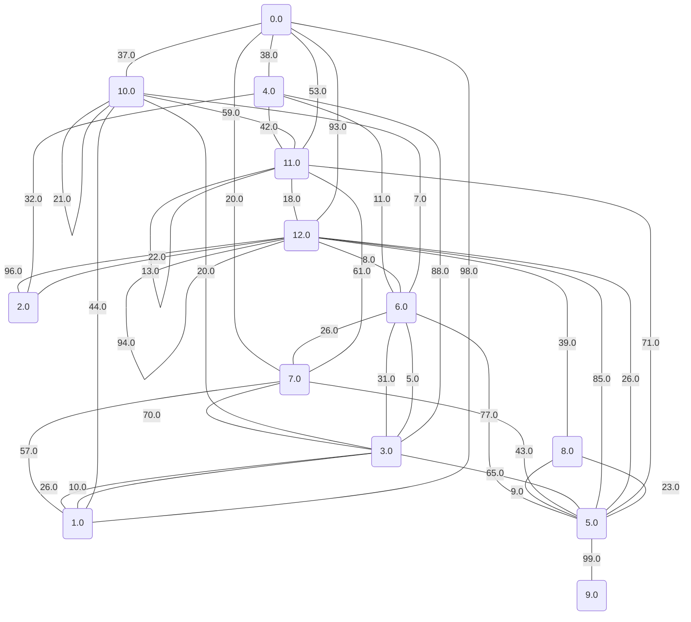

```mermaid
graph TD;
	0("0.0");
	1("1.0");
	2("2.0");
	3("3.0");
	4("4.0");
	5("5.0");
	6("6.0");
	7("7.0");
	8("8.0");
	9("9.0");
	10("10.0");
	11("11.0");
	12("12.0");
	12 -- "39.0" --- 8;
	7 -- "57.0" --- 1;
	6 -- "77.0" --- 5;
	12 -- "96.0" --- 2;
	7 -- "70.0" --- 3;
	8 -- "9.0" --- 5;
	11 -- "53.0" --- 0;
	7 -- "43.0" --- 5;
	11 -- "18.0" --- 12;
	4 -- "42.0" --- 11;
	3 -- "26.0" --- 1;
	0 -- "38.0" --- 4;
	0 -- "37.0" --- 10;
	3 -- "65.0" --- 5;
	3 -- "10.0" --- 1;
	12 -- "85.0" --- 5;
	4 -- "11.0" --- 6;
	5 -- "71.0" --- 11;
	12 -- "26.0" --- 5;
	12 -- "8.0" --- 6;
	0 -- "20.0" --- 7;
	10 -- "44.0" --- 1;
	12 -- "94.0" --- 12;
	3 -- "31.0" --- 6;
	10 -- "59.0" --- 11;
	10 -- "21.0" --- 10;
	10 -- "20.0" --- 3;
	3 -- "5.0" --- 6;
	5 -- "23.0" --- 8;
	11 -- "13.0" --- 11;
	6 -- "26.0" --- 7;
	3 -- "88.0" --- 4;
	1 -- "98.0" --- 0;
	5 -- "99.0" --- 9;
	4 -- "32.0" --- 2;
	10 -- "7.0" --- 6;
	12 -- "93.0" --- 0;
	12 -- "22.0" --- 2;
	11 -- "61.0" --- 7;
```

