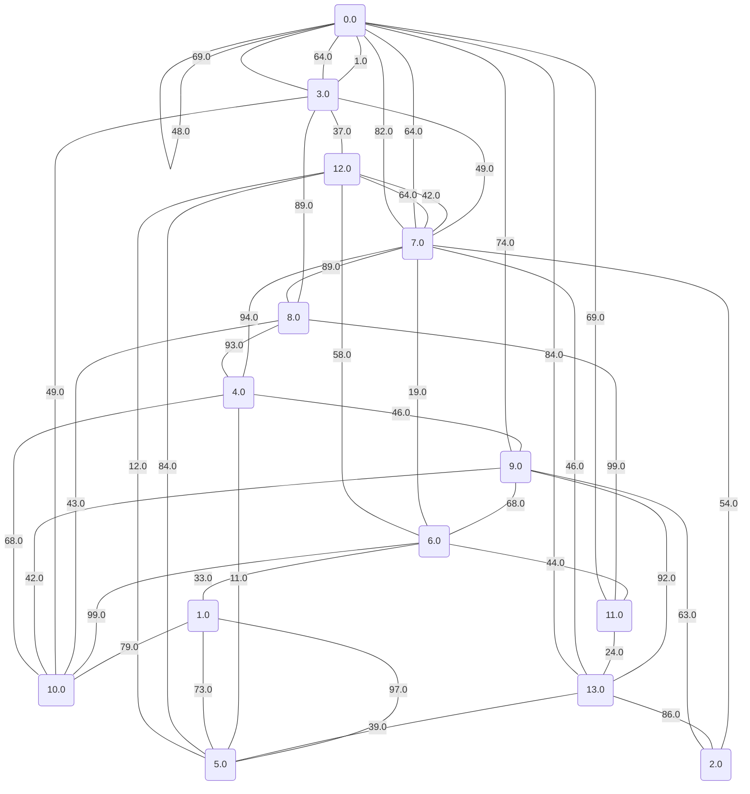

```mermaid
graph TD;
	0("0.0");
	1("1.0");
	2("2.0");
	3("3.0");
	4("4.0");
	5("5.0");
	6("6.0");
	7("7.0");
	8("8.0");
	9("9.0");
	10("10.0");
	11("11.0");
	12("12.0");
	13("13.0");
	7 -- "54.0" --- 2;
	3 -- "69.0" --- 0;
	6 -- "44.0" --- 11;
	9 -- "92.0" --- 13;
	9 -- "74.0" --- 0;
	6 -- "58.0" --- 12;
	1 -- "97.0" --- 5;
	7 -- "94.0" --- 4;
	8 -- "93.0" --- 4;
	3 -- "37.0" --- 12;
	11 -- "69.0" --- 0;
	6 -- "33.0" --- 1;
	8 -- "99.0" --- 11;
	13 -- "39.0" --- 5;
	3 -- "49.0" --- 7;
	7 -- "64.0" --- 12;
	1 -- "79.0" --- 10;
	9 -- "68.0" --- 6;
	0 -- "1.0" --- 3;
	4 -- "11.0" --- 5;
	5 -- "12.0" --- 12;
	13 -- "86.0" --- 2;
	0 -- "64.0" --- 3;
	10 -- "49.0" --- 3;
	3 -- "89.0" --- 8;
	1 -- "73.0" --- 5;
	9 -- "63.0" --- 2;
	4 -- "46.0" --- 9;
	7 -- "64.0" --- 0;
	10 -- "42.0" --- 9;
	7 -- "82.0" --- 0;
	6 -- "99.0" --- 10;
	7 -- "19.0" --- 6;
	11 -- "24.0" --- 13;
	8 -- "43.0" --- 10;
	7 -- "89.0" --- 8;
	0 -- "48.0" --- 0;
	12 -- "42.0" --- 7;
	10 -- "68.0" --- 4;
	13 -- "46.0" --- 7;
	12 -- "84.0" --- 5;
	13 -- "84.0" --- 0;
```

