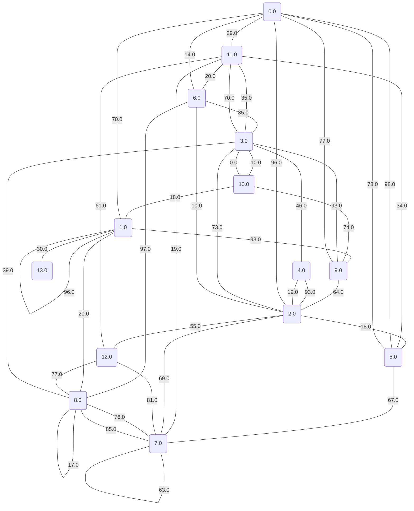

```mermaid
graph TD;
	0("0.0");
	1("1.0");
	2("2.0");
	3("3.0");
	4("4.0");
	5("5.0");
	6("6.0");
	7("7.0");
	8("8.0");
	9("9.0");
	10("10.0");
	11("11.0");
	12("12.0");
	13("13.0");
	6 -- "35.0" --- 3;
	5 -- "34.0" --- 11;
	5 -- "67.0" --- 7;
	8 -- "17.0" --- 8;
	9 -- "93.0" --- 3;
	9 -- "64.0" --- 2;
	1 -- "70.0" --- 0;
	2 -- "73.0" --- 3;
	1 -- "48.0" --- 1;
	3 -- "70.0" --- 11;
	3 -- "10.0" --- 10;
	2 -- "10.0" --- 6;
	0 -- "29.0" --- 11;
	4 -- "93.0" --- 2;
	11 -- "19.0" --- 7;
	12 -- "61.0" --- 11;
	6 -- "97.0" --- 8;
	1 -- "96.0" --- 1;
	2 -- "69.0" --- 7;
	4 -- "19.0" --- 2;
	5 -- "98.0" --- 0;
	1 -- "93.0" --- 9;
	12 -- "81.0" --- 7;
	1 -- "20.0" --- 8;
	10 -- "18.0" --- 1;
	3 -- "46.0" --- 4;
	5 -- "73.0" --- 0;
	9 -- "77.0" --- 0;
	11 -- "20.0" --- 6;
	8 -- "76.0" --- 7;
	12 -- "77.0" --- 8;
	3 -- "39.0" --- 8;
	3 -- "0.0" --- 10;
	1 -- "30.0" --- 13;
	11 -- "35.0" --- 3;
	2 -- "55.0" --- 12;
	7 -- "63.0" --- 7;
	10 -- "74.0" --- 9;
	0 -- "14.0" --- 6;
	8 -- "85.0" --- 7;
	0 -- "96.0" --- 2;
	2 -- "15.0" --- 5;
```

