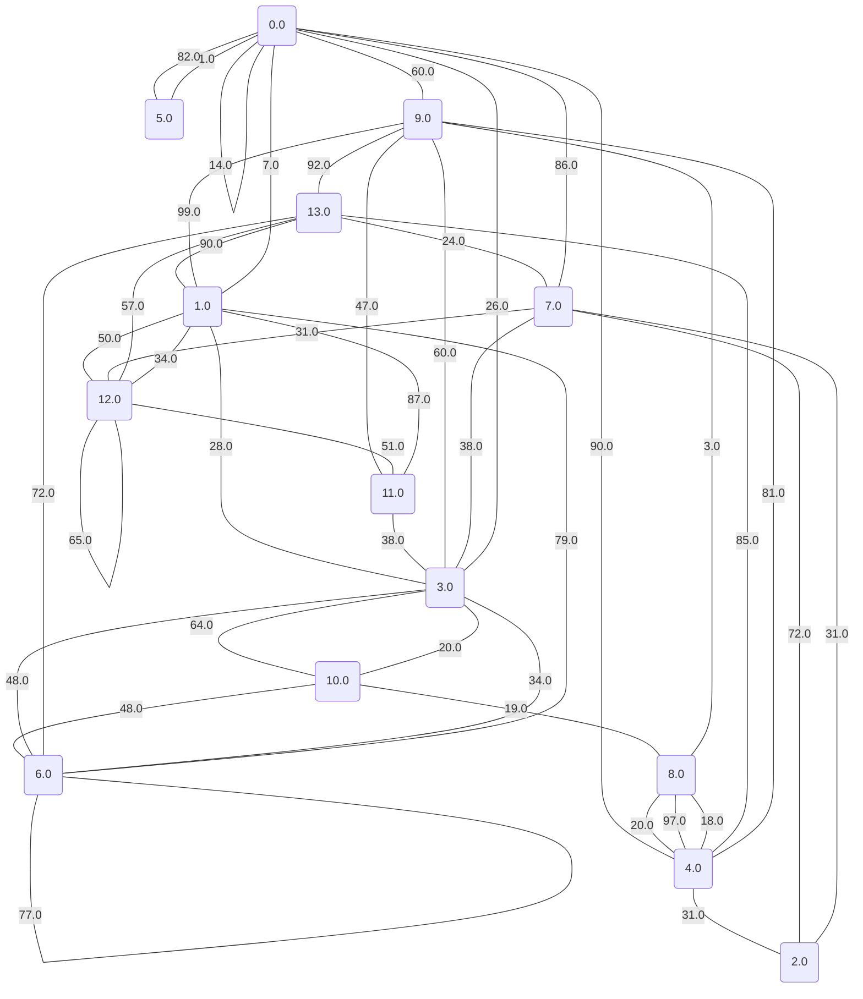

```mermaid
graph TD;
	0("0.0");
	1("1.0");
	2("2.0");
	3("3.0");
	4("4.0");
	5("5.0");
	6("6.0");
	7("7.0");
	8("8.0");
	9("9.0");
	10("10.0");
	11("11.0");
	12("12.0");
	13("13.0");
	12 -- "65.0" --- 12;
	6 -- "72.0" --- 13;
	9 -- "92.0" --- 13;
	6 -- "77.0" --- 6;
	13 -- "90.0" --- 1;
	0 -- "60.0" --- 9;
	1 -- "28.0" --- 3;
	4 -- "31.0" --- 2;
	4 -- "18.0" --- 8;
	9 -- "47.0" --- 11;
	5 -- "1.0" --- 0;
	11 -- "87.0" --- 1;
	0 -- "90.0" --- 4;
	4 -- "85.0" --- 13;
	12 -- "57.0" --- 13;
	10 -- "48.0" --- 6;
	7 -- "72.0" --- 2;
	1 -- "50.0" --- 12;
	11 -- "38.0" --- 3;
	9 -- "99.0" --- 1;
	0 -- "14.0" --- 0;
	3 -- "48.0" --- 6;
	7 -- "86.0" --- 0;
	1 -- "7.0" --- 0;
	7 -- "31.0" --- 2;
	6 -- "34.0" --- 3;
	9 -- "60.0" --- 3;
	8 -- "3.0" --- 9;
	10 -- "19.0" --- 8;
	6 -- "79.0" --- 1;
	7 -- "38.0" --- 3;
	12 -- "34.0" --- 1;
	3 -- "64.0" --- 10;
	12 -- "51.0" --- 11;
	8 -- "20.0" --- 4;
	4 -- "81.0" --- 9;
	13 -- "24.0" --- 7;
	8 -- "97.0" --- 4;
	0 -- "26.0" --- 3;
	0 -- "82.0" --- 5;
	7 -- "31.0" --- 12;
	10 -- "20.0" --- 3;
```

