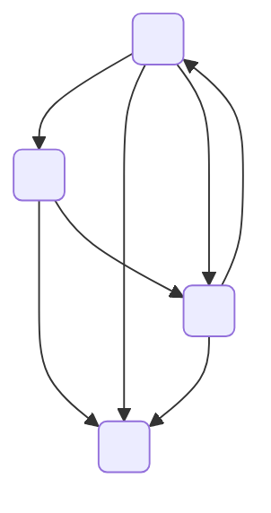
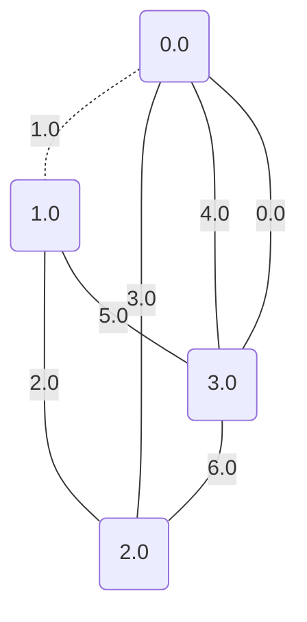
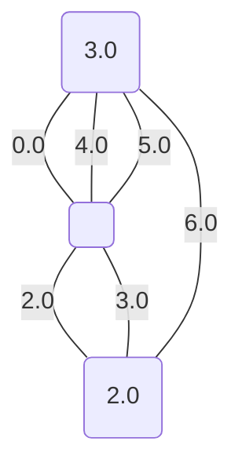
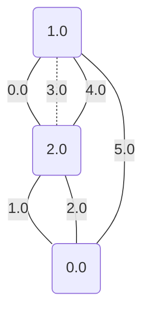
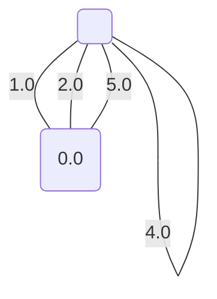

# Problém **MinCut** *(minimální řez)* pomocí pravděpodobnostního algoritmu

Algoritmus jen v každé iteraci náhodně kontrahuje jednu hranu, dokud nemá právě jen 2 vrcholy, potom počet hran je roven velikosti řezu.

V našem případě si ukážeme jen jednu iteraci. Normální se algoritmus vícekrát opakuje pro větší pravděpodobnost správného výsledku.

## Graf na vstupu:

Protože problém minimálního řezu řešíme nad neorientovaným grafem, tak všechny hrany změníme na neorientované.

Nyní už budeme postupně iterovat. S tím, že v každém momentu očíslujeme vrcholy a hrany pro přehlednost, a taky se zbavíme smyček.

## Krok 1

V tomhle kroku kontrahujeme hranu `[0;NaN;1]`.

A získáváme:

## Krok 2

V tomhle kroku kontrahujeme hranu `[0;NaN;2]`.

A získáváme:

Tímto konkrétním postupem jsem došli k výsledku, že minimální řez má velikost nejvýše: **3**

*Pokud bychom tento algoritmus zopakovali aspoň tolikrát, kolik je vrcholů, tak získáme výsledek: **3***

## Další postupy:

Protože graf není nijak velký, tak lze použít hledání pomocí hrubé síly. To pak dává výsledek: **3**

Díky tomu, že jsme mohli použít hledání hrubou silou, tak Kargber Steinův algoritmus nám vrátí stejný výsledek, protože v tak malém grafu hend používá hrubou sílu.
