# Problém **MinCut** *(minimální řez)* pomocí pravděpodobnostního algoritmu

Algoritmus jen v každé iteraci náhodně kontrahuje jednu hranu, dokud nemá právě jen 2 vrcholy, potom počet hran je roven velikosti řezu.

V našem případě si ukážeme jen jednu iteraci. Normální se algoritmus vícekrát opakuje pro větší pravděpodobnost správného výsledku.

## Graf na vstupu:

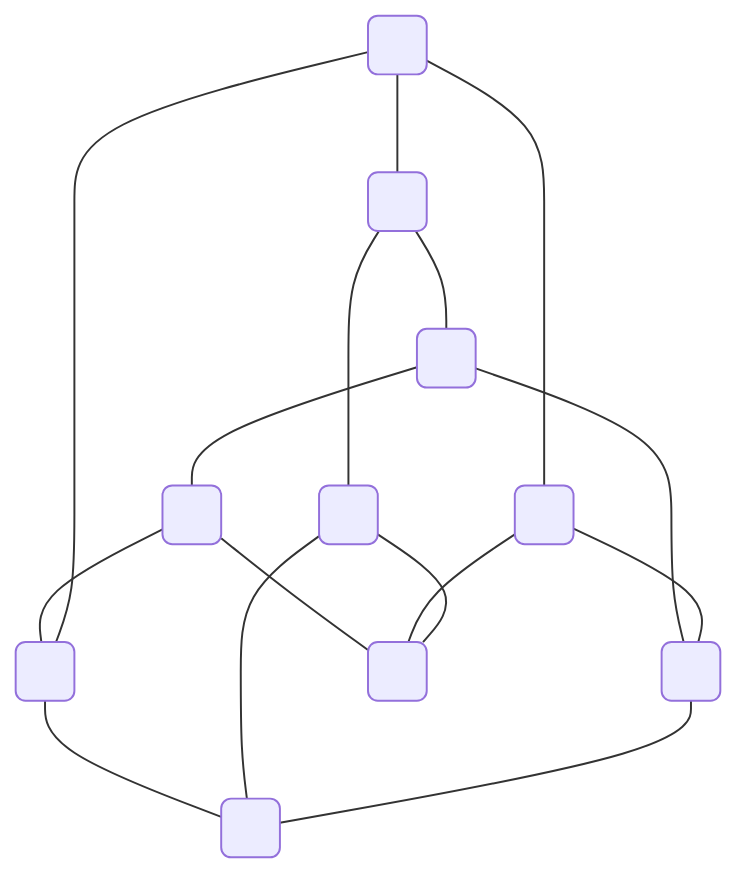

Nyní už budeme postupně iterovat. S tím, že v každém momentu očíslujeme vrcholy a hrany pro přehlednost, a taky se zbavíme smyček.

## Krok 1

V tomhle kroku kontrahujeme hranu `[1;NaN;6]`.

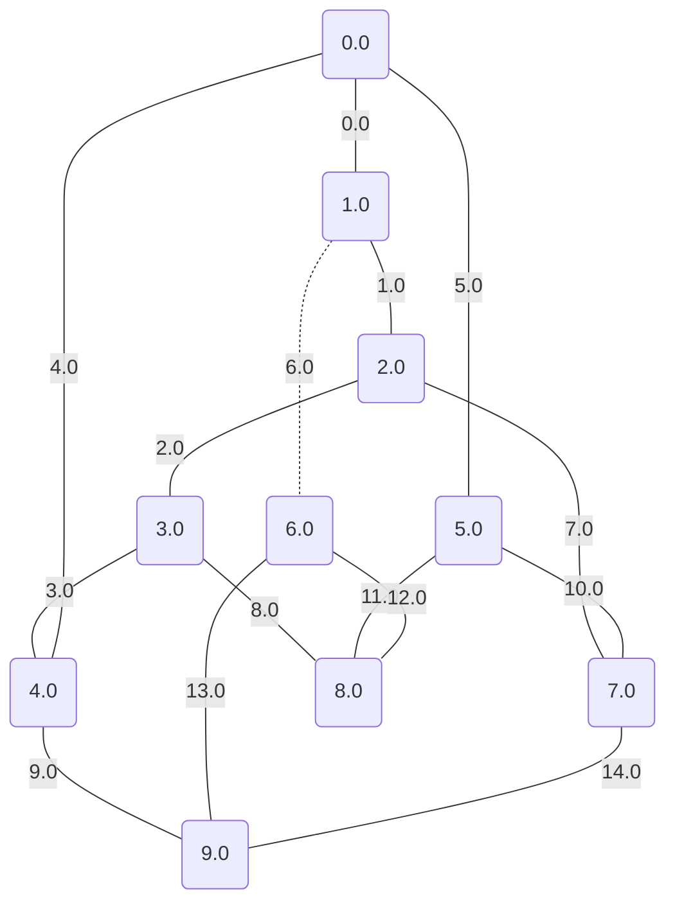

A získáváme:

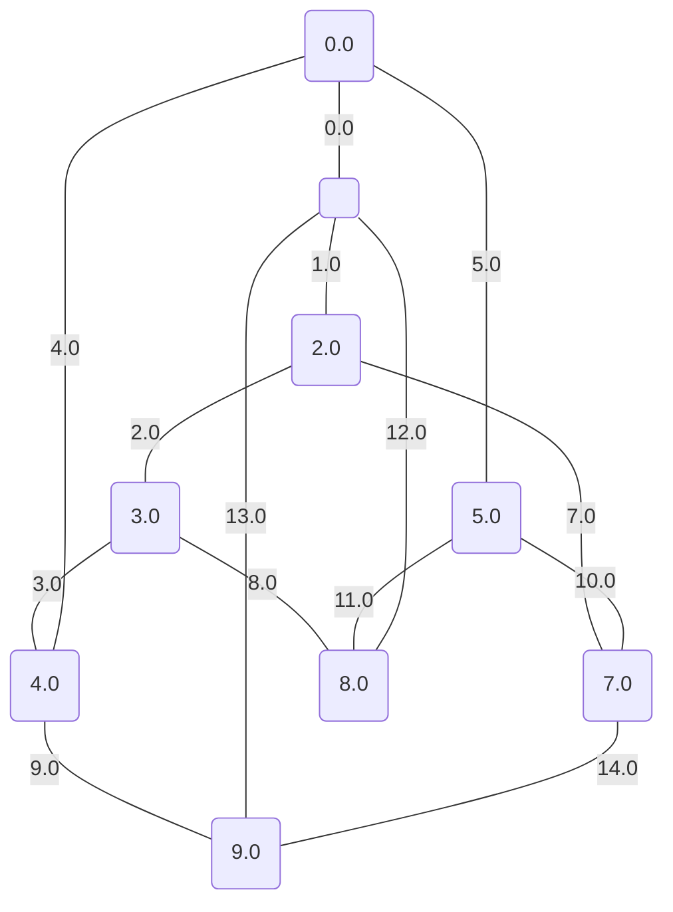

## Krok 2

V tomhle kroku kontrahujeme hranu `[1;NaN;6]`.

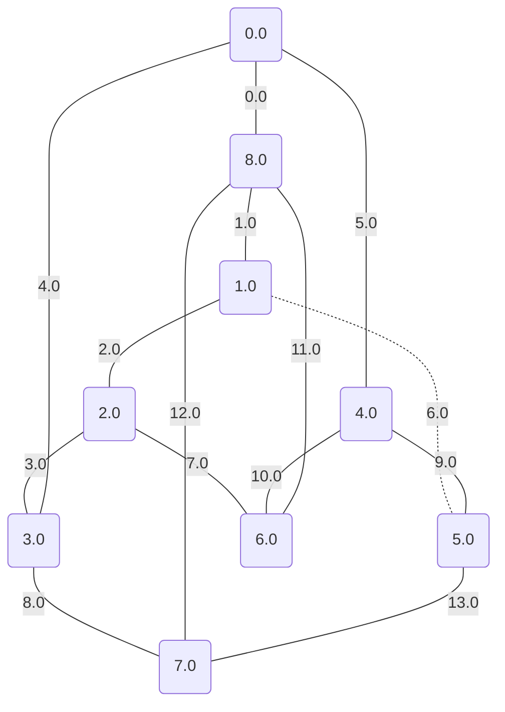

A získáváme:

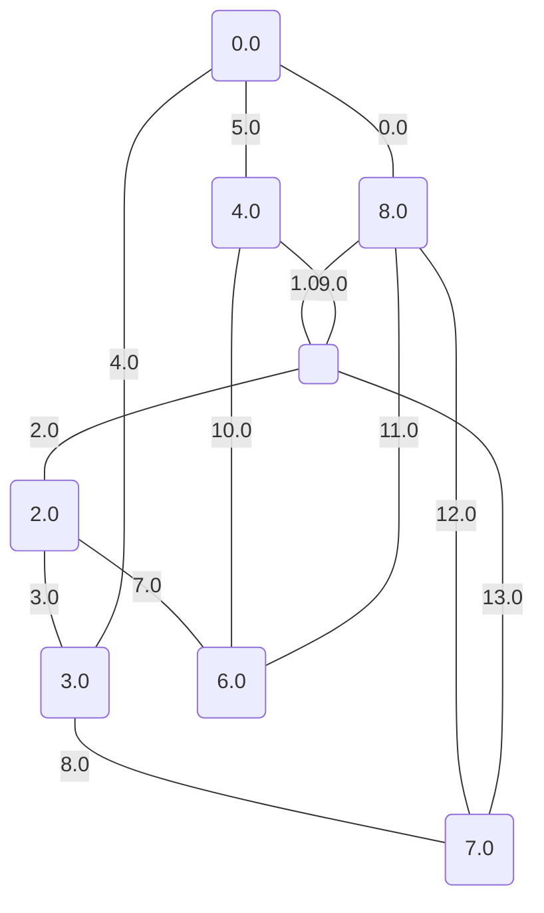

## Krok 3

V tomhle kroku kontrahujeme hranu `[3;NaN;8]`.

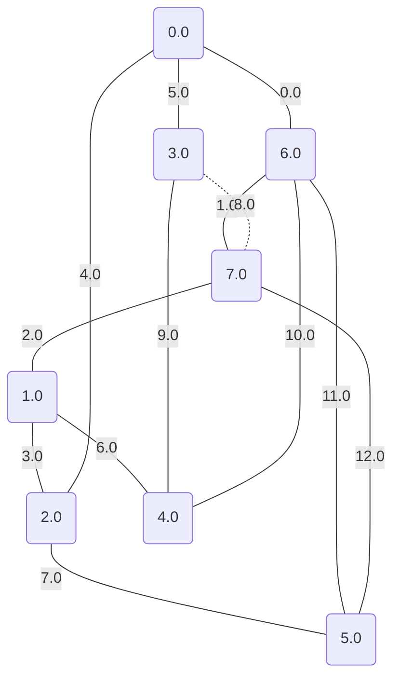

A získáváme:

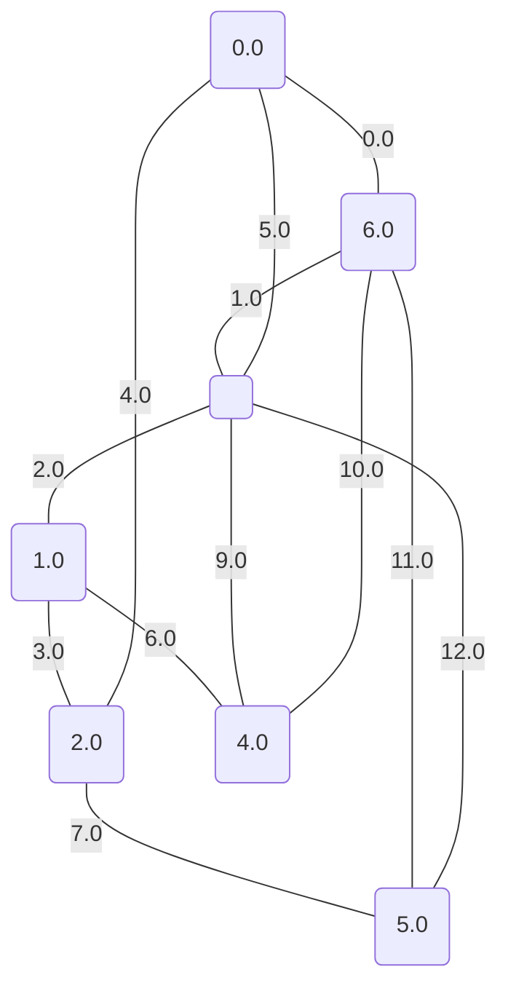

## Krok 4

V tomhle kroku kontrahujeme hranu `[2;NaN;7]`.

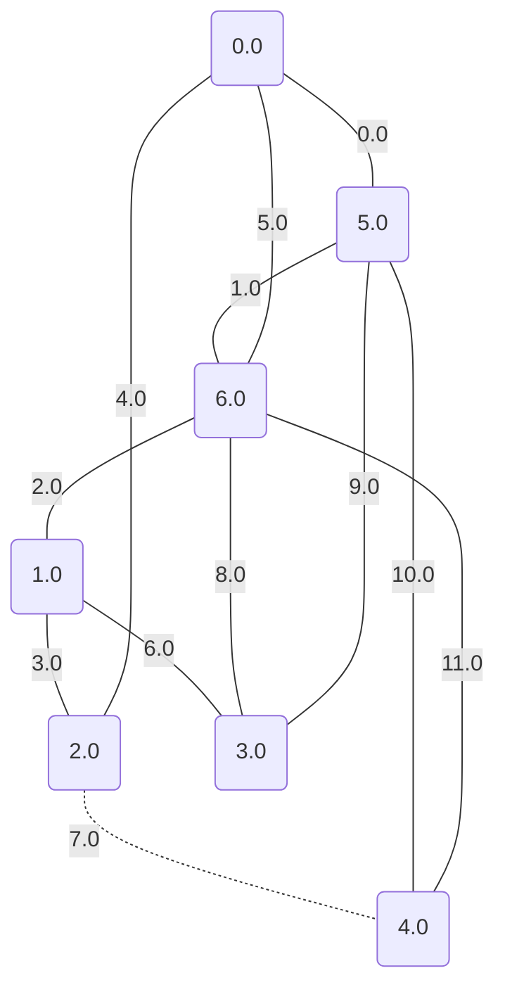

A získáváme:

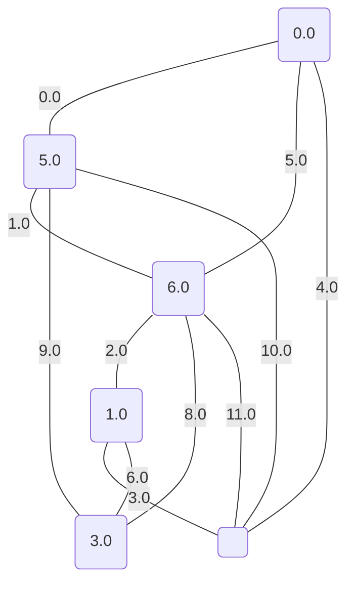

## Krok 5

V tomhle kroku kontrahujeme hranu `[4;NaN;9]`.

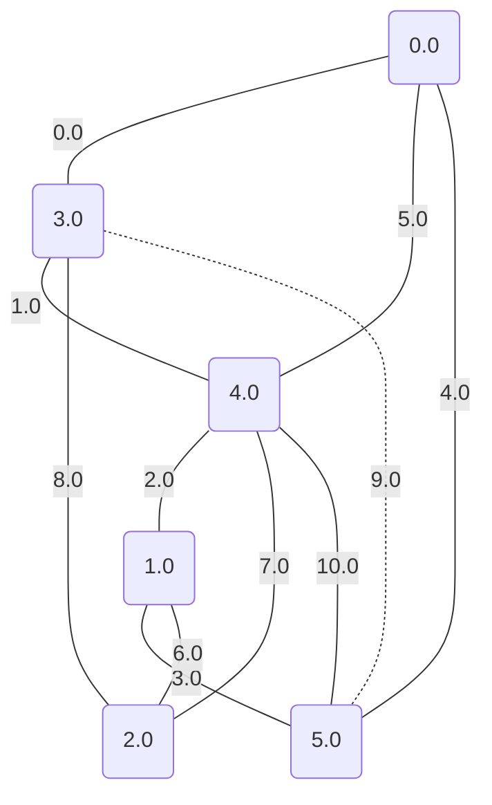

A získáváme:

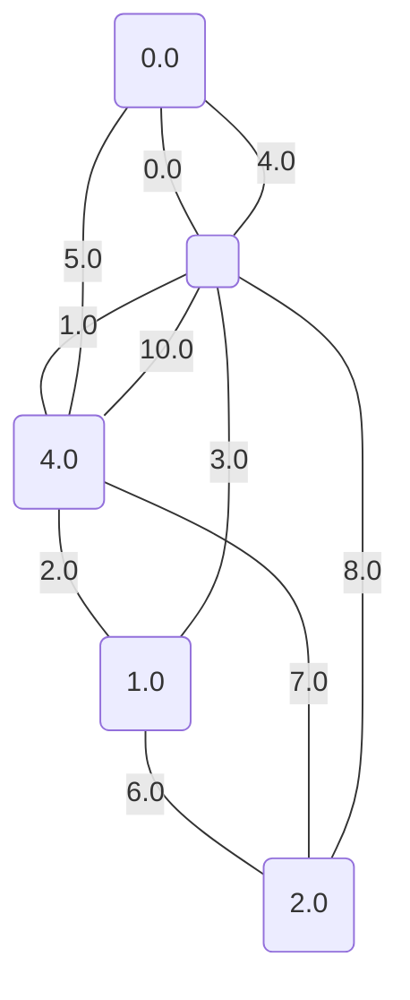

## Krok 6

V tomhle kroku kontrahujeme hranu `[0;NaN;1]`.

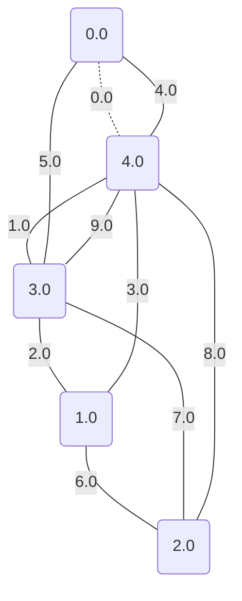

A získáváme:

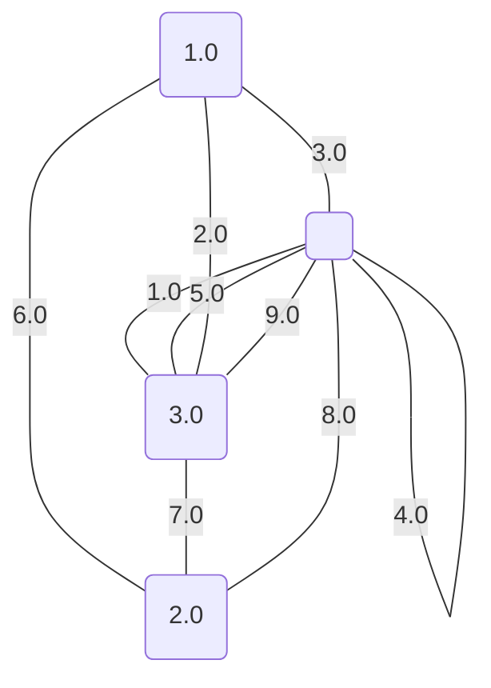

## Krok 7

V tomhle kroku kontrahujeme hranu `[2;NaN;3]`.

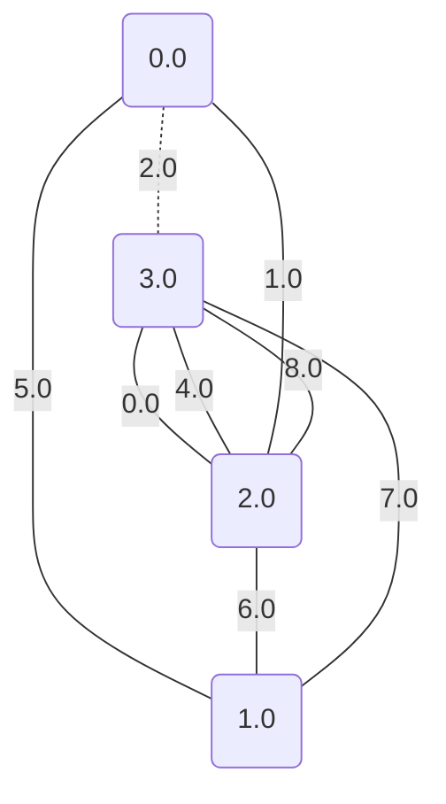

A získáváme:

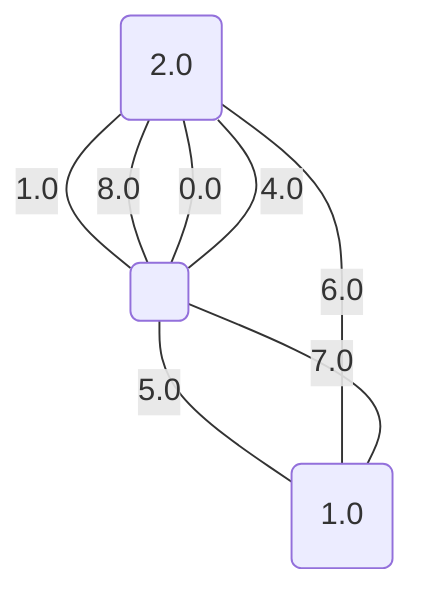

## Krok 8

V tomhle kroku kontrahujeme hranu `[0;NaN;1]`.

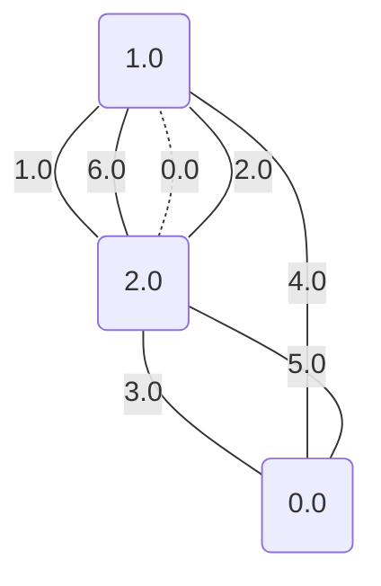

A získáváme:

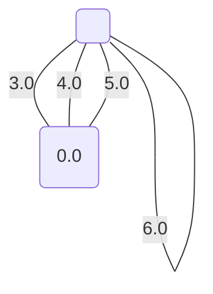

Tímto konkrétním postupem jsem došli k výsledku, že minimální řez má velikost nejvýše: **3**

*Pokud bychom tento algoritmus zopakovali aspoň tolikrát, kolik je vrcholů, tak získáme výsledek: **3***

## Další postupy:

Protože graf je celkem velký, tak není doporučený použít hledání hrubou sílou, ale za to můžeme na druhou stranu použít celkem dost efektivní algoritmus Karger-Steinův, který používá předem ukázanou kontrakci hrany. Přesně je to rekurzivní používání daného postupu na nižším počtu vrcholů, dokud se nedostane na nějakou hodnotu, po které se už použije hrubá síla. Konkrétní výsledek potom je: **3**
