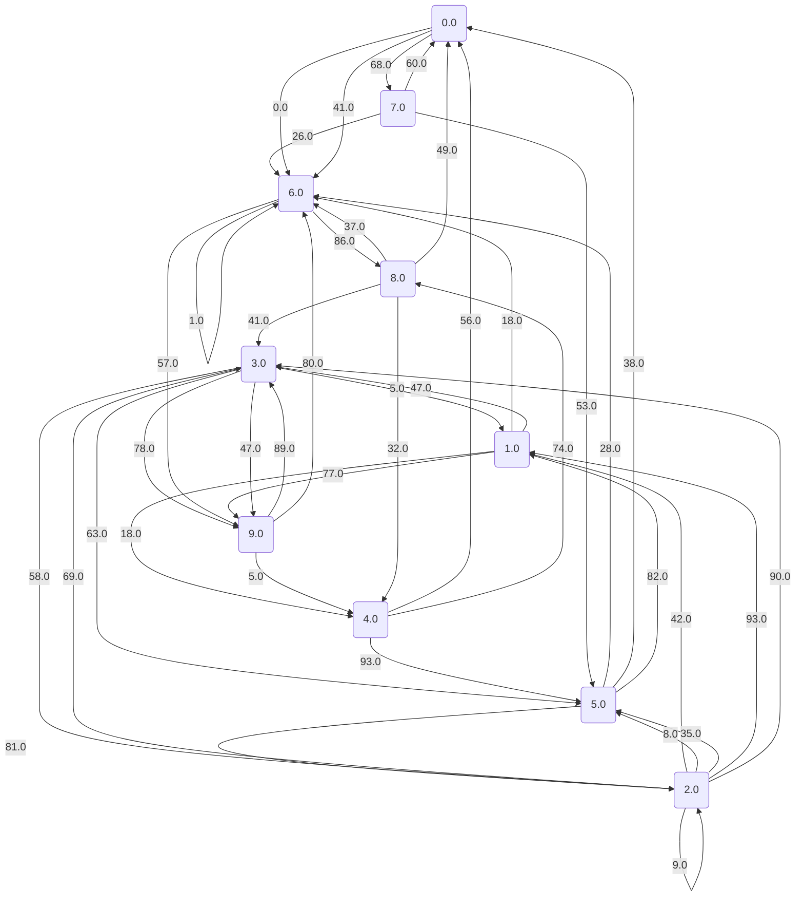
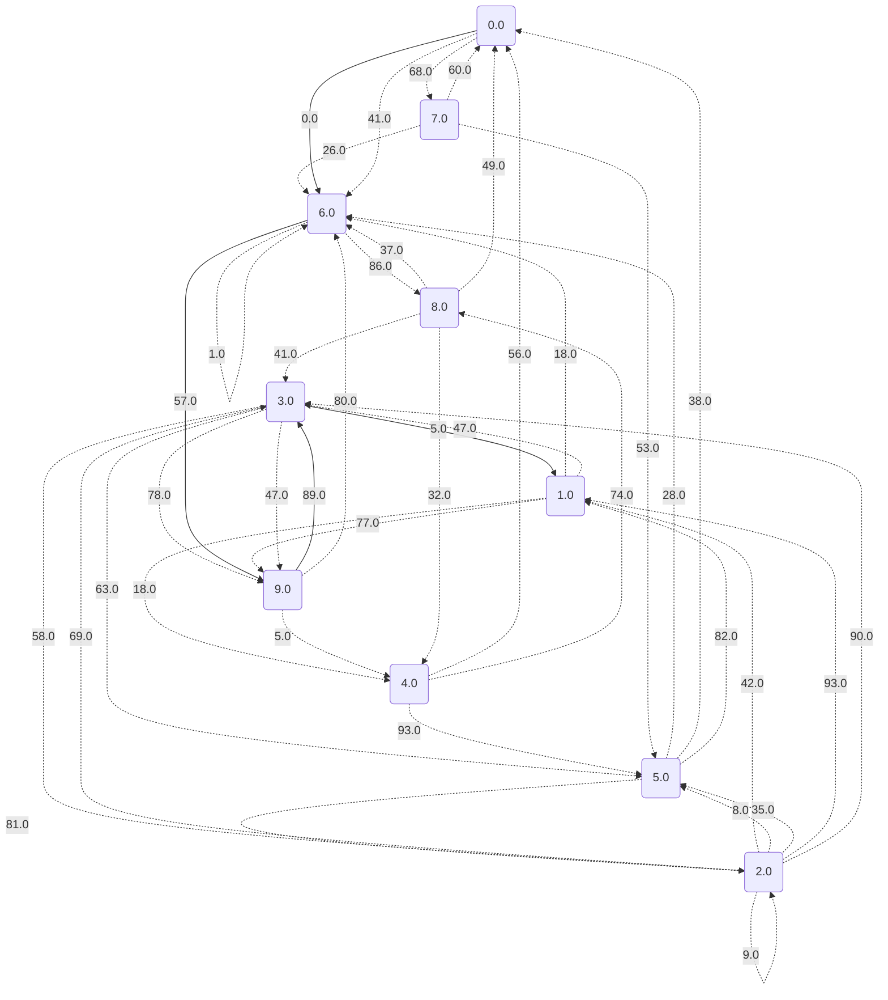
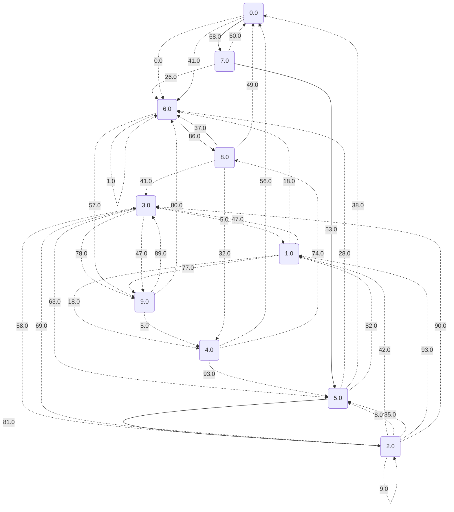
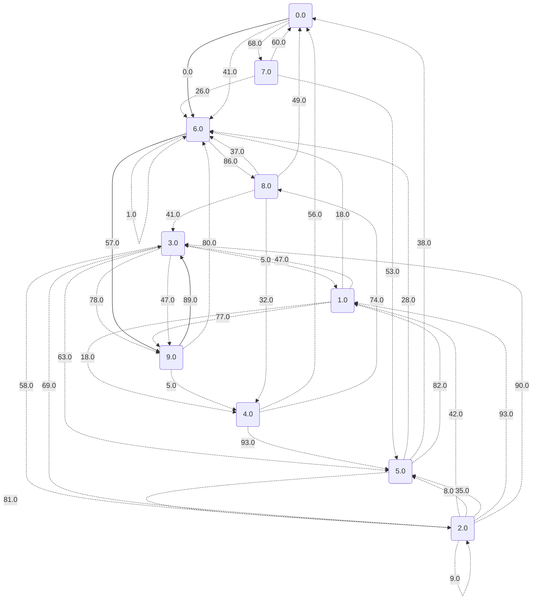
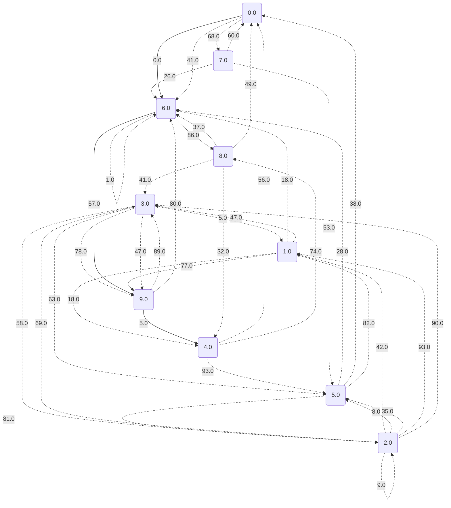
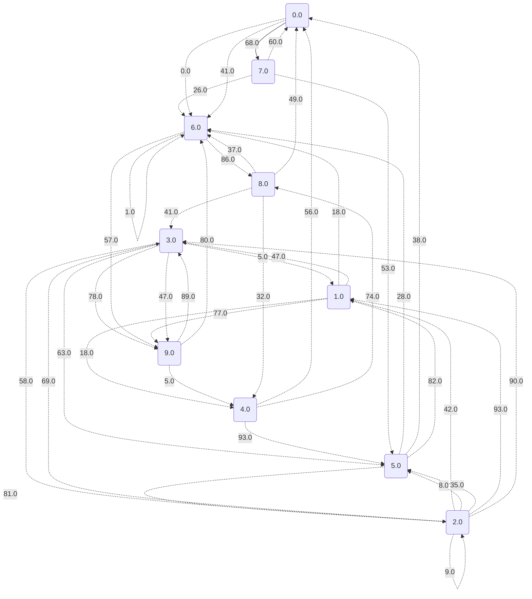

# Dijkstrův algoritmus pro nejkratší cesty

Náš vstupní graf je následující:

Nyní se podíváme na hodnoty nejkratších cest a také na konkrétní cesty.

## Vrchol 0 je to: 0.0

## Vrchol 1 je to: 182.0

## Vrchol 2 je to: 202.0

## Vrchol 3 je to: 146.0

## Vrchol 4 je to: 62.0

## Vrchol 5 je to: 121.0

## Vrchol 6 je to: 0.0

## Vrchol 7 je to: 68.0

## Vrchol 8 je to: 86.0

## Vrchol 9 je to: 57.0

