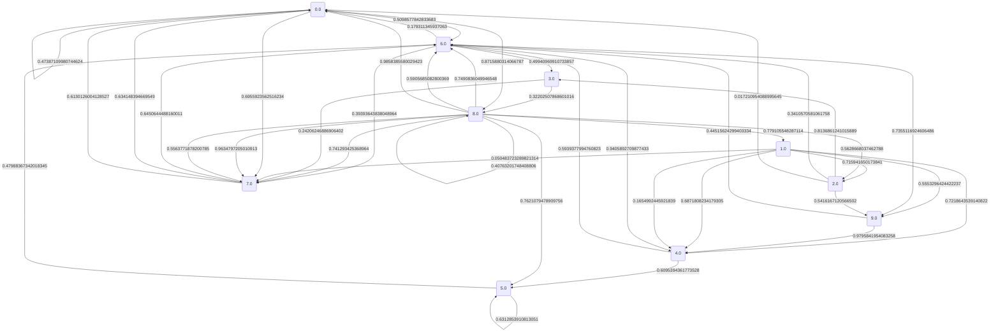
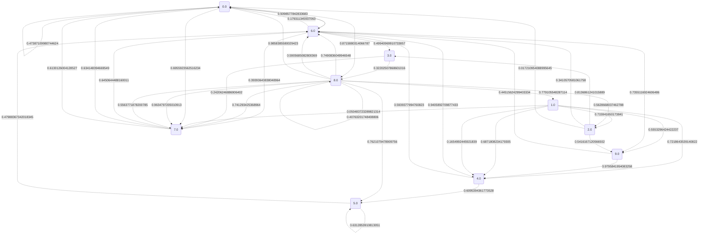

# Dijkstrův algoritmus pro nejkratší cesty

Náš vstupní graf je následující:

Nyní se podíváme na hodnoty nejkratších cest a také na konkrétní cesty.

## Vrchol 0 je to: 0.0

## Vrchol 1 je to: 2.110398110363831

## Vrchol 2 je to: 1.894159365822996

## Vrchol 3 je to: 1.009267483390707

## Vrchol 4 je to: 1.4504470552711115

## Vrchol 5 je to: 2.093400509967693

## Vrchol 6 je to: 0.5098577842833683

## Vrchol 7 je to: 0.6955923562516234

## Vrchol 8 je to: 0.8715880314066787

## Vrchol 9 je to: 1.2453694767440169

