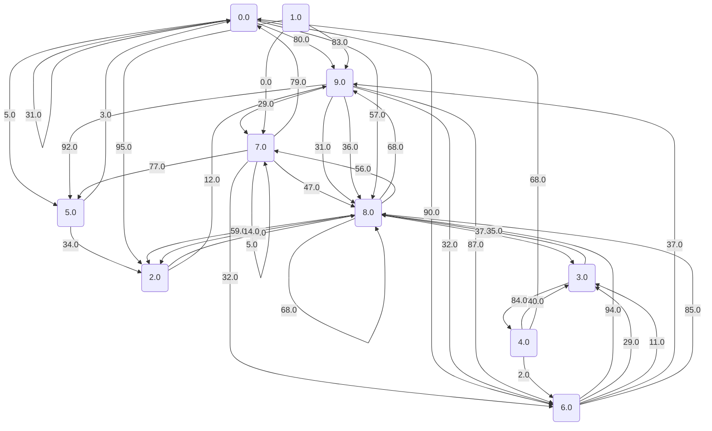
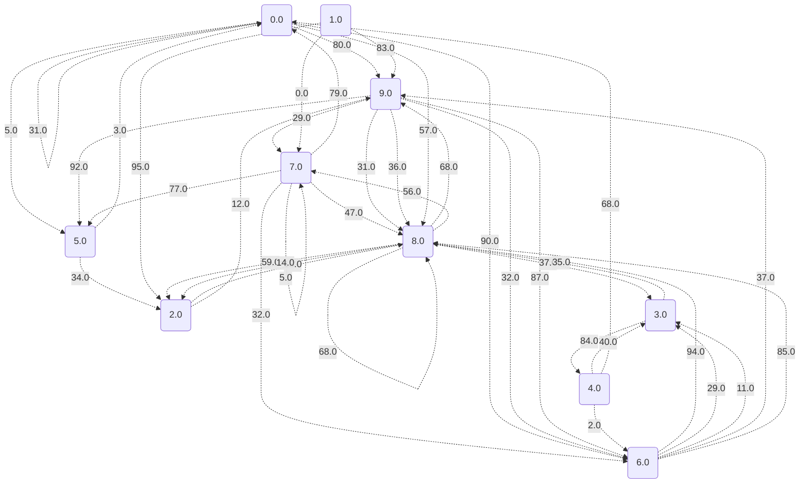
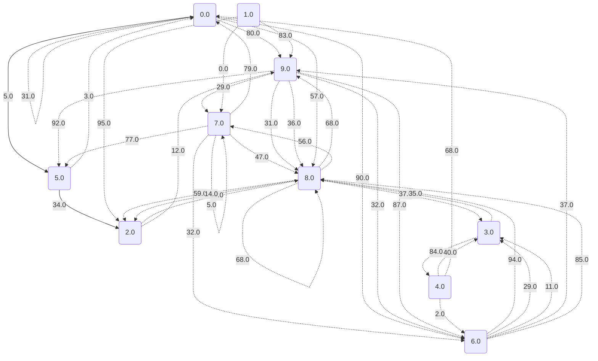
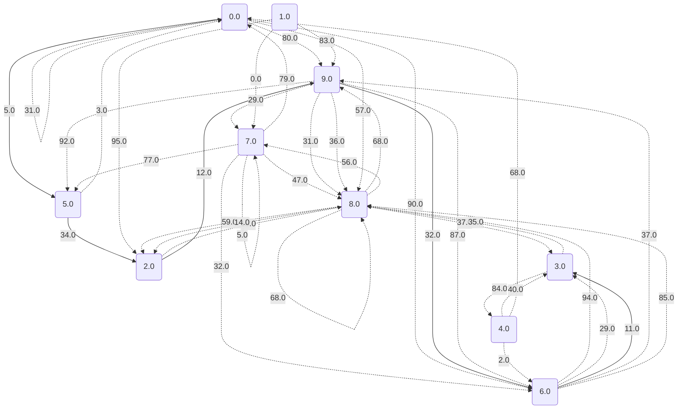
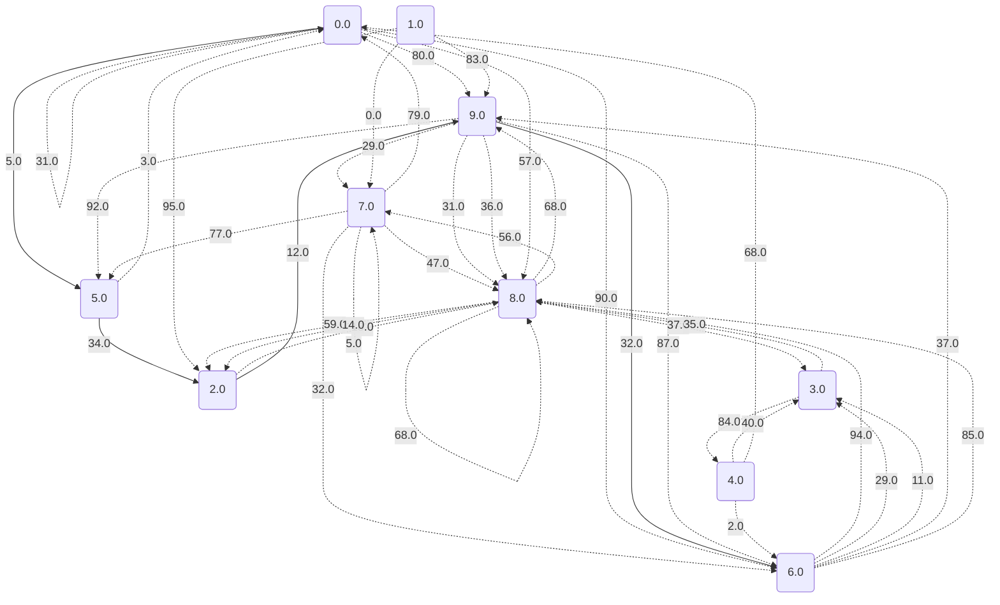
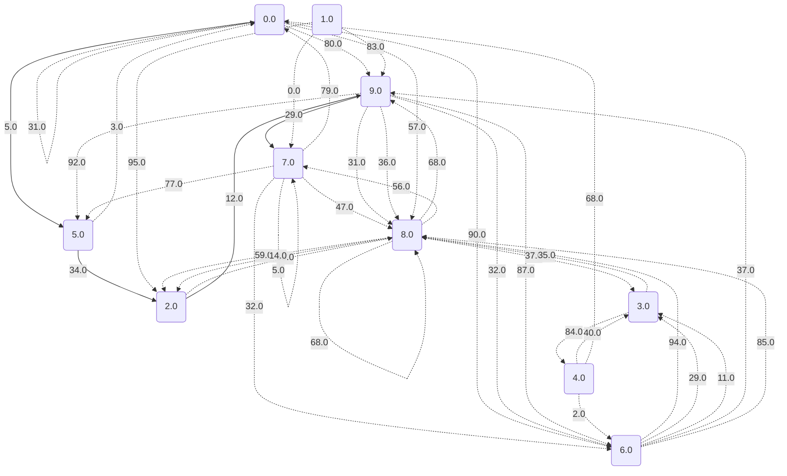

# Dijkstrův algoritmus pro nejkratší cesty

Náš vstupní graf je následující:

Nyní se podíváme na hodnoty nejkratších cest a také na konkrétní cesty.

## Vrchol 0 je to: 0.0

## Vrchol 1 je to: 1.7976931348623157E308

## Vrchol 2 je to: 39.0

## Vrchol 3 je to: 94.0

## Vrchol 4 je to: 178.0

## Vrchol 5 je to: 5.0

## Vrchol 6 je to: 83.0

## Vrchol 7 je to: 80.0

## Vrchol 8 je to: 57.0

## Vrchol 9 je to: 51.0

