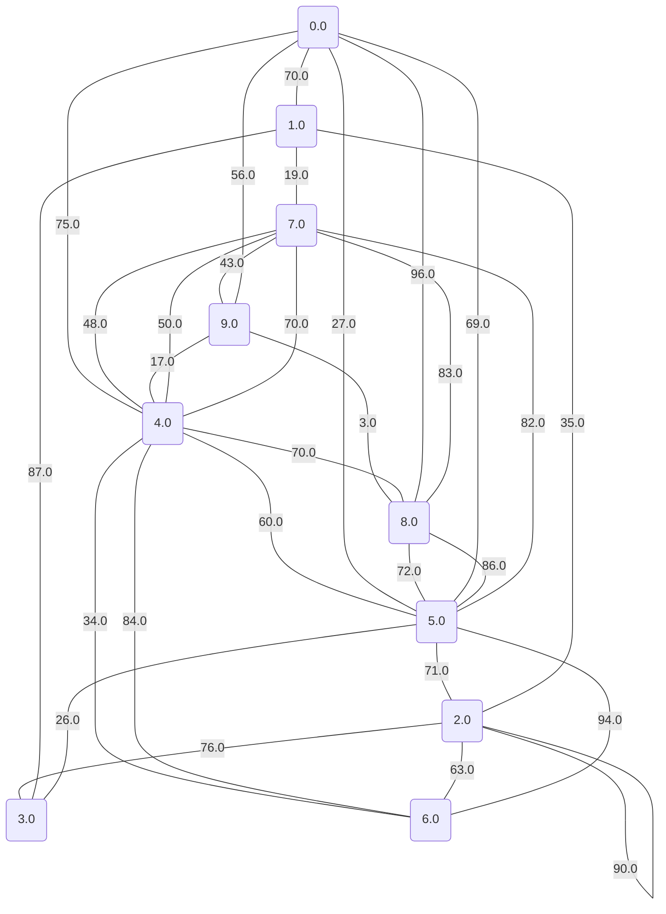
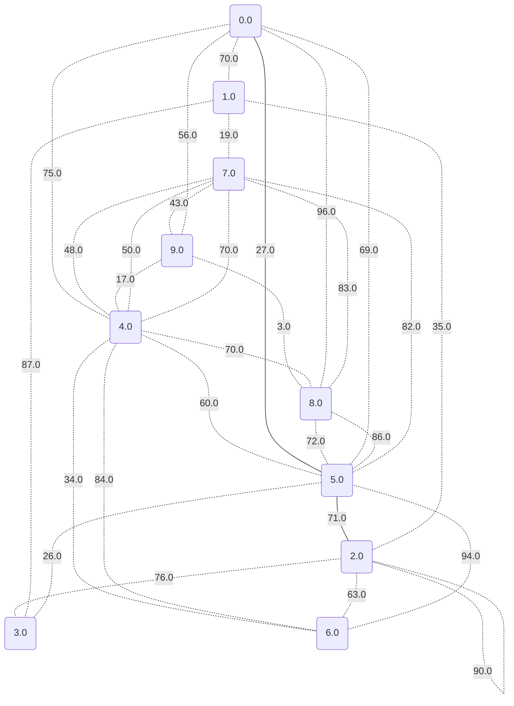
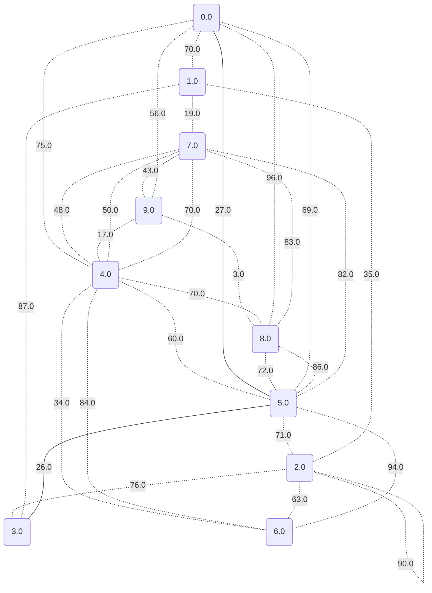
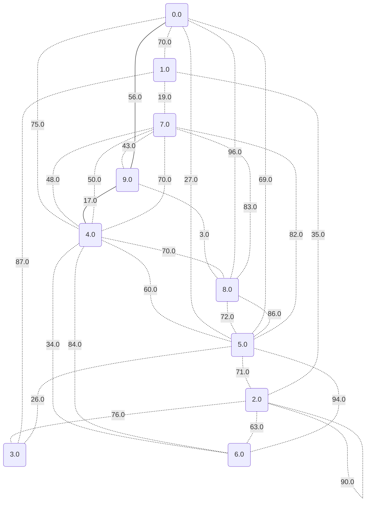
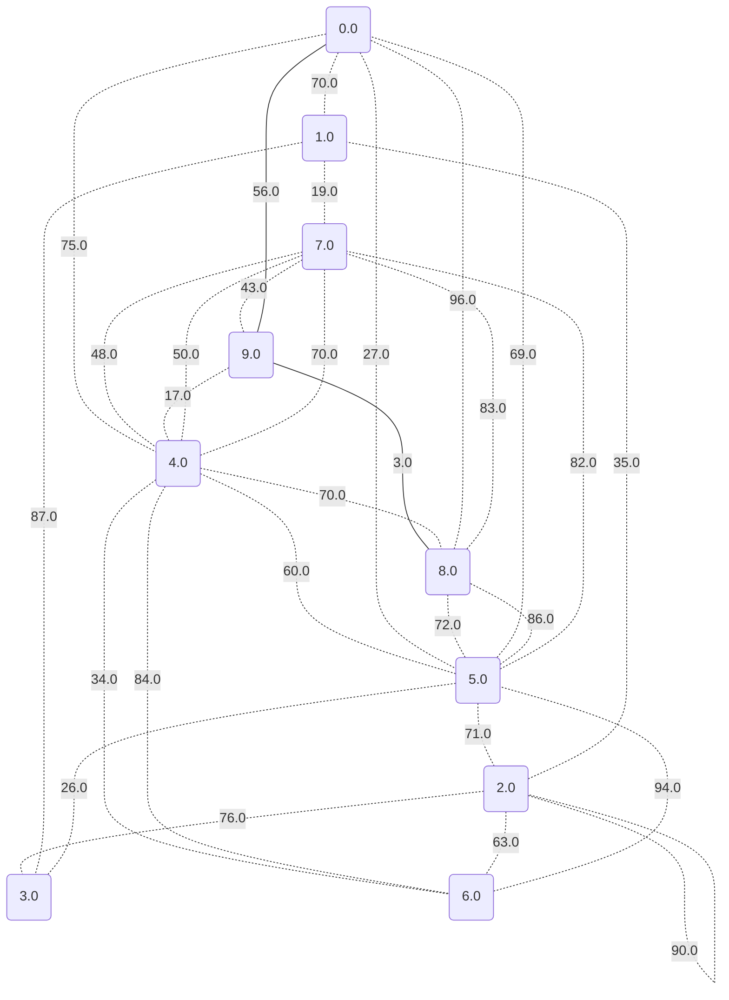

# Dijkstrův algoritmus pro nejkratší cesty

Náš vstupní graf je následující:

Nyní se podíváme na hodnoty nejkratších cest a také na konkrétní cesty.

## Vrchol 0 je to: 0.0

## Vrchol 1 je to: 70.0

## Vrchol 2 je to: 98.0

## Vrchol 3 je to: 53.0

## Vrchol 4 je to: 73.0

## Vrchol 5 je to: 27.0

## Vrchol 6 je to: 107.0

## Vrchol 7 je to: 99.0

## Vrchol 8 je to: 59.0

## Vrchol 9 je to: 56.0

