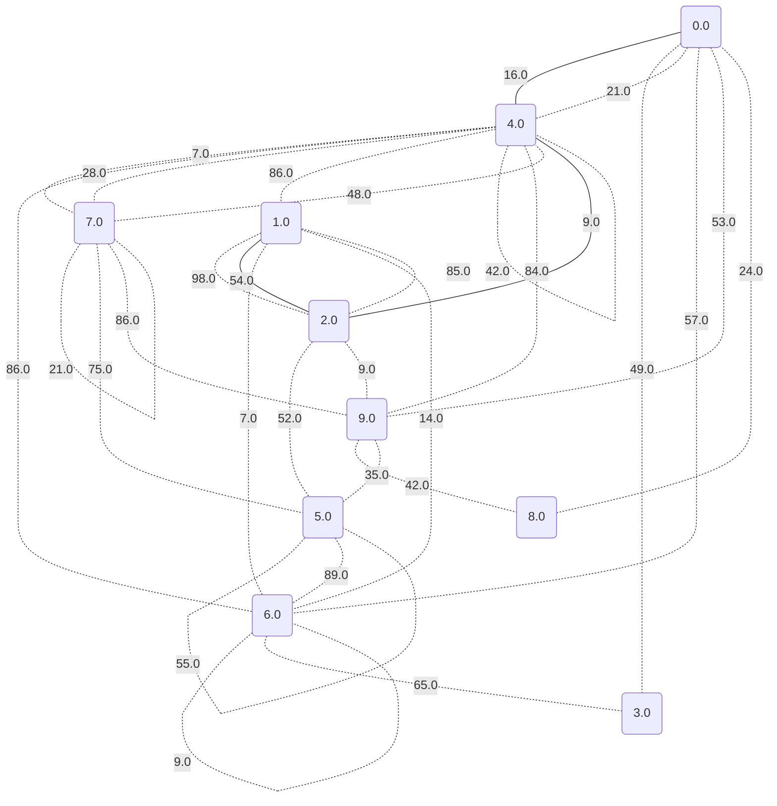
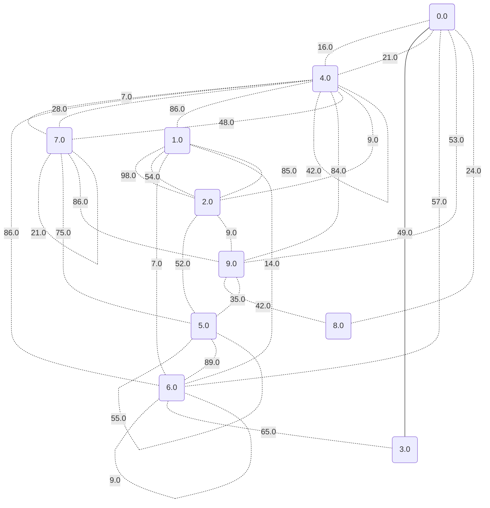
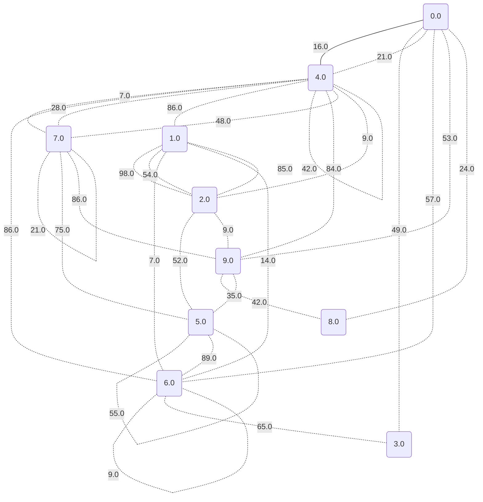
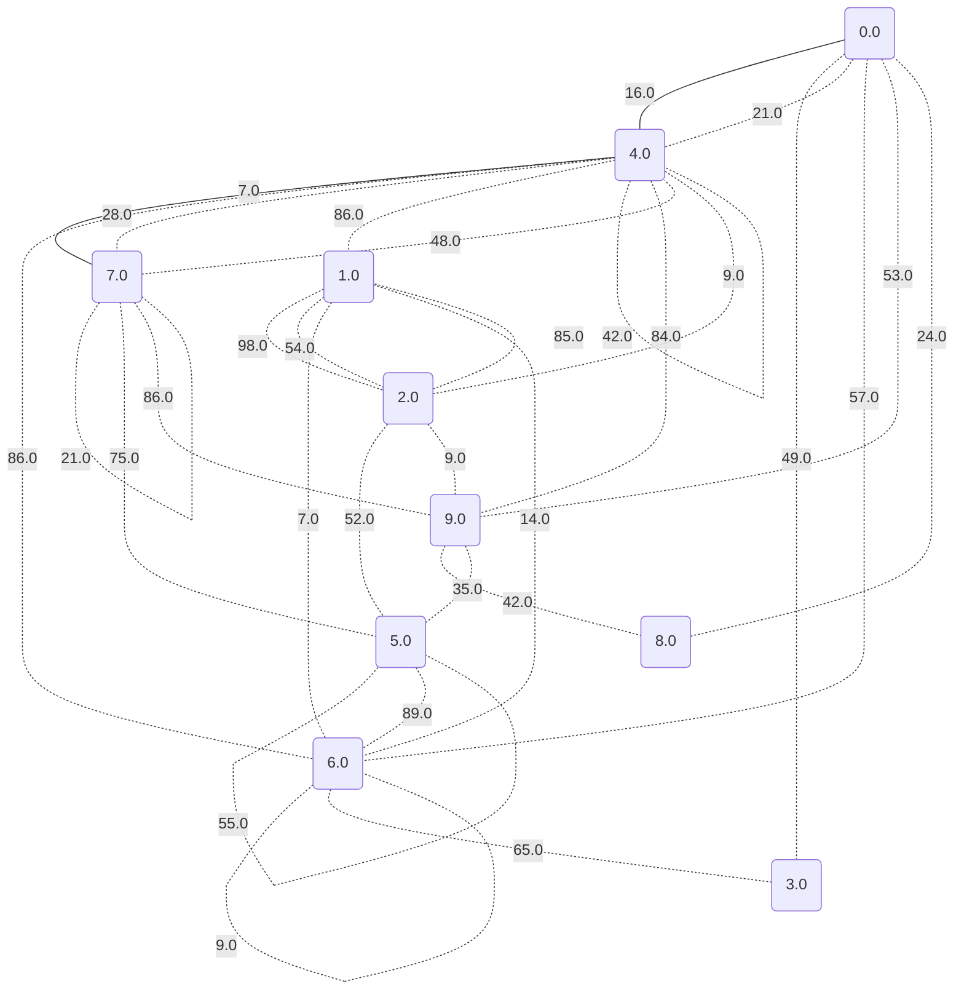
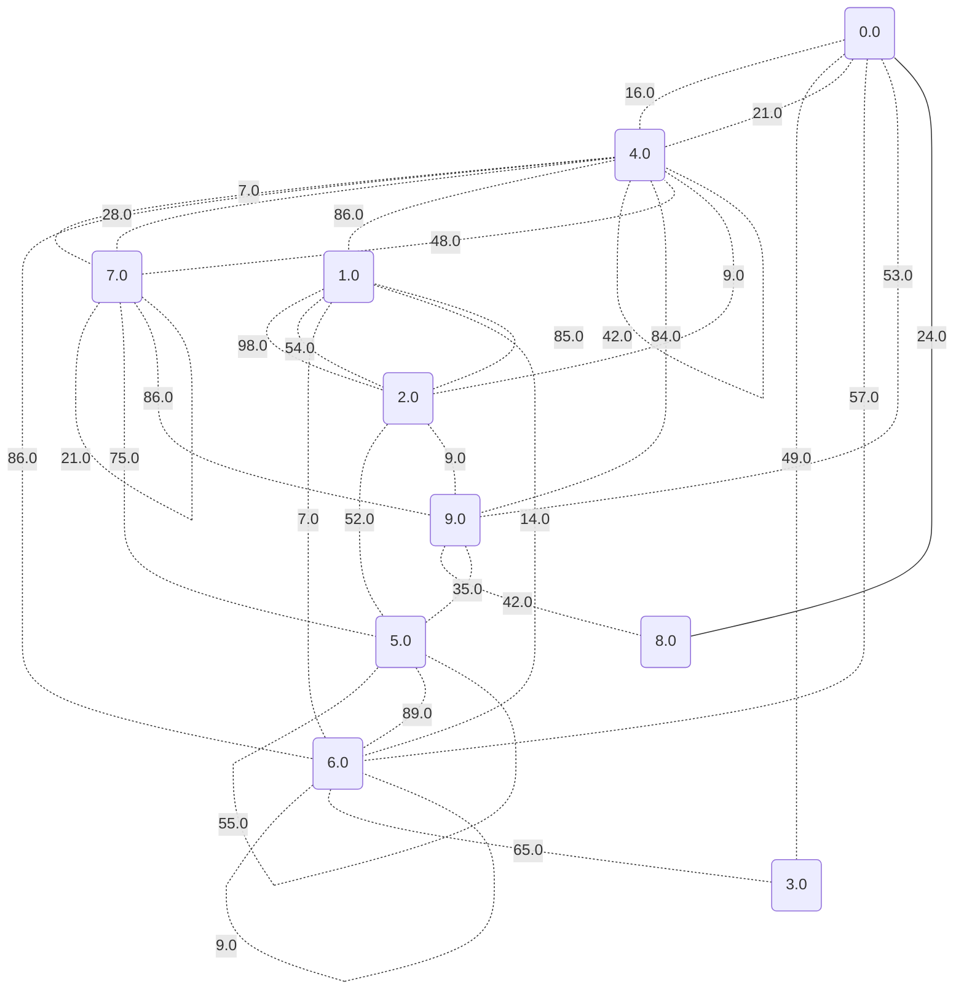

# Dijkstrův algoritmus pro nejkratší cesty

Náš vstupní graf je následující:

Nyní se podíváme na hodnoty nejkratších cest a také na konkrétní cesty.

## Vrchol 0 je to: 0.0

## Vrchol 1 je to: 79.0

## Vrchol 2 je to: 25.0

## Vrchol 3 je to: 49.0

## Vrchol 4 je to: 16.0

## Vrchol 5 je to: 69.0

## Vrchol 6 je to: 57.0

## Vrchol 7 je to: 23.0

## Vrchol 8 je to: 24.0

## Vrchol 9 je to: 34.0

