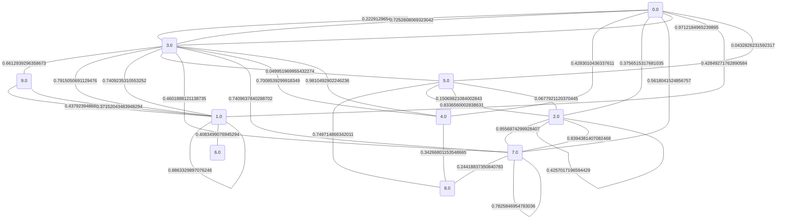
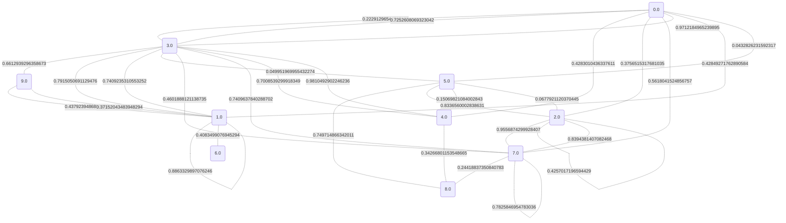
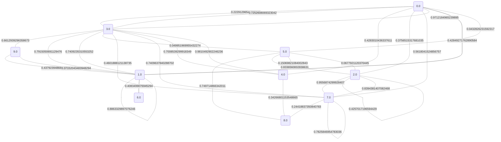
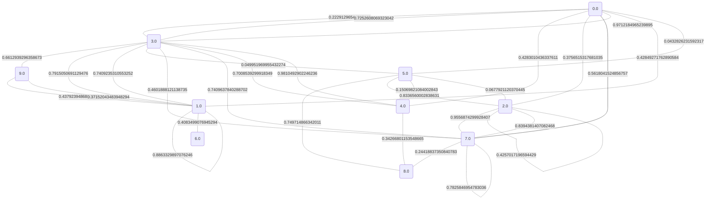

# Dijkstrův algoritmus pro nejkratší cesty

Náš vstupní graf je následující:

Nyní se podíváme na hodnoty nejkratších cest a také na konkrétní cesty.

## Vrchol 0 je to: 0.0

## Vrchol 1 je to: 0.42849271762890584

## Vrchol 2 je to: 0.1110747351962762

## Vrchol 3 je to: 0.09323459311466398

## Vrchol 4 je to: 0.19398083399926014

## Vrchol 5 je to: 0.0432826231592317

## Vrchol 6 je to: 0.8368426253234352

## Vrchol 7 je to: 0.5618041524856757

## Vrchol 8 je to: 0.5366488455347468

## Vrchol 9 je to: 0.7545285227505313

