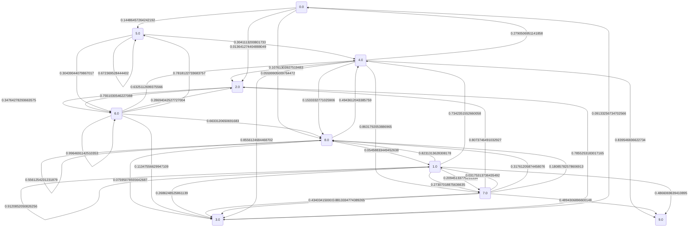
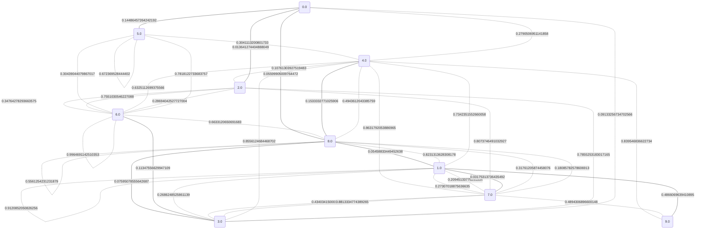

# Nalezení minimální kostry (*MST*)

Máme daný na vstupu graf:

```mermaid
graph TD;
	0("0.0");
	1("1.0");
	2("2.0");
	3("3.0");
	4("4.0");
	5("5.0");
	6("6.0");
	7("7.0");
	8("8.0");
	9("9.0");
	4 -- "0.10761303927519483" --> 2;
	2 -- "0.34764278293663575" --> 6;
	7 -- "0.8073746491032927" --> 2;
	2 -- "0.7551030546227088" --> 6;
	4 -- "0.8631792053886965" --> 7;
	0 -- "0.14486457264242192" --> 5;
	8 -- "0.5561254231231879" --> 8;
	6 -- "0.6325112699375566" --> 4;
	1 -- "0.27307018875636635" --> 7;
	1 -- "0.20945133775251334" --> 7;
	0 -- "0.05599905009764472" --> 8;
	8 -- "0.07595078555642687" --> 3;
	1 -- "0.8231313628308178" --> 8;
	1 -- "0.7342351552660058" --> 4;
	6 -- "0.11347556629947109" --> 3;
	7 -- "0.03175313736435492" --> 1;
	5 -- "0.672369528444402" --> 5;
	0 -- "0.013641274404888049" --> 2;
	7 -- "0.31761205874458076" --> 8;
	1 -- "0.2686248525861139" --> 3;
	5 -- "0.3041113200801733" --> 4;
	7 -- "0.434034150001425" --> 3;
	4 -- "0.839546836622734" --> 9;
	6 -- "0.6633120650691683" --> 8;
	8 -- "0.4943612043385759" --> 4;
	4 -- "0.1533332771025906" --> 8;
	6 -- "0.9964691142510353" --> 6;
	4 -- "0.2790506951141858" --> 0;
	5 -- "0.30439044079867017" --> 6;
	7 -- "0.4894306896600148" --> 9;
	1 -- "0.9120852050826256" --> 1;
	7 -- "0.8813334774389265" --> 3;
	8 -- "0.05458833449452638" --> 1;
	6 -- "0.28694042527727004" --> 2;
	4 -- "0.8556124684468702" --> 3;
	2 -- "0.7855253183017165" --> 3;
	1 -- "0.4866069639410895" --> 9;
	6 -- "0.7818122733683757" --> 5;
	3 -- "0.09133256734702566" --> 0;
	7 -- "0.18085782578606913" --> 8;
```

Protože daný graf je orientovaný, tak jej převedeme na neorientovaný.

Hledanou nejlehčí kostrou je znázorněna na grafu:

```mermaid
graph TD;
	0("0.0");
	1("1.0");
	2("2.0");
	3("3.0");
	4("4.0");
	5("5.0");
	6("6.0");
	7("7.0");
	8("8.0");
	9("9.0");
	4 -. "0.10761303927519483" -.- 2;
	2 -. "0.34764278293663575" -.- 6;
	7 -. "0.8073746491032927" -.- 2;
	2 -. "0.7551030546227088" -.- 6;
	4 -. "0.8631792053886965" -.- 7;
	0 -- "0.14486457264242192" --- 5;
	8 -. "0.5561254231231879" -.- 8;
	6 -. "0.6325112699375566" -.- 4;
	1 -. "0.27307018875636635" -.- 7;
	1 -. "0.20945133775251334" -.- 7;
	0 -- "0.05599905009764472" --- 8;
	8 -- "0.07595078555642687" --- 3;
	1 -. "0.8231313628308178" -.- 8;
	1 -. "0.7342351552660058" -.- 4;
	6 -- "0.11347556629947109" --- 3;
	7 -- "0.03175313736435492" --- 1;
	5 -. "0.672369528444402" -.- 5;
	0 -- "0.013641274404888049" --- 2;
	7 -. "0.31761205874458076" -.- 8;
	1 -. "0.2686248525861139" -.- 3;
	5 -. "0.3041113200801733" -.- 4;
	7 -. "0.434034150001425" -.- 3;
	4 -. "0.839546836622734" -.- 9;
	6 -. "0.6633120650691683" -.- 8;
	8 -. "0.4943612043385759" -.- 4;
	4 -- "0.1533332771025906" --- 8;
	6 -. "0.9964691142510353" -.- 6;
	4 -. "0.2790506951141858" -.- 0;
	5 -. "0.30439044079867017" -.- 6;
	7 -. "0.4894306896600148" -.- 9;
	1 -. "0.9120852050826256" -.- 1;
	7 -. "0.8813334774389265" -.- 3;
	8 -- "0.05458833449452638" --- 1;
	6 -. "0.28694042527727004" -.- 2;
	4 -. "0.8556124684468702" -.- 3;
	2 -. "0.7855253183017165" -.- 3;
	1 -- "0.4866069639410895" --- 9;
	6 -. "0.7818122733683757" -.- 5;
	3 -. "0.09133256734702566" -.- 0;
	7 -. "0.18085782578606913" -.- 8;
```

