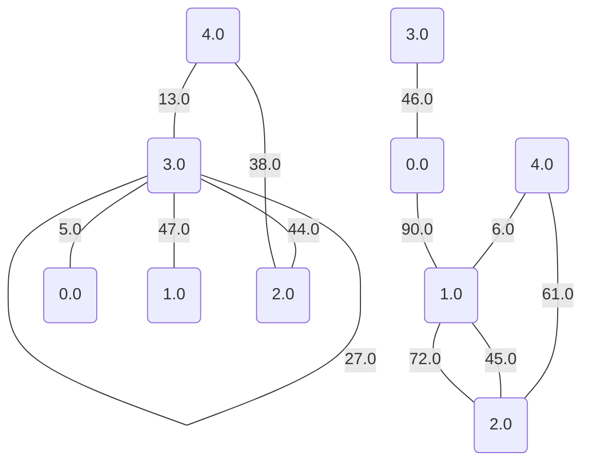
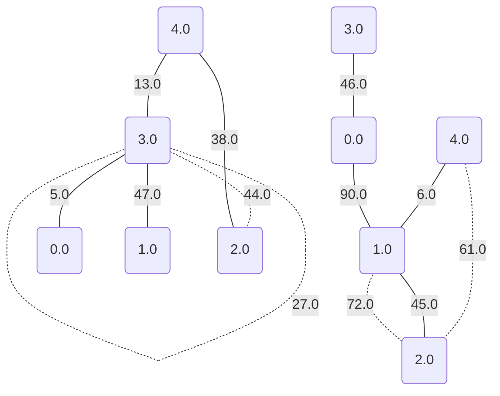

# Nalezení minimální kostry (*MST*)

Máme daný na vstupu graf:

```mermaid
graph TD;
	0("0.0");
	1("1.0");
	2("2.0");
	3("3.0");
	4("4.0");
	5("0.0");
	6("1.0");
	7("2.0");
	8("3.0");
	9("4.0");
	8 -- "47.0" --- 6;
	9 -- "13.0" --- 8;
	8 -- "44.0" --- 7;
	8 -- "27.0" --- 8;
	8 -- "5.0" --- 5;
	9 -- "38.0" --- 7;
	3 -- "46.0" --- 0;
	4 -- "61.0" --- 2;
	4 -- "6.0" --- 1;
	0 -- "90.0" --- 1;
	2 -- "72.0" --- 1;
	1 -- "45.0" --- 2;
```

Hledanou nejlehčí kostrou je znázorněna na grafu:

```mermaid
graph TD;
	0("0.0");
	1("1.0");
	2("2.0");
	3("3.0");
	4("4.0");
	5("0.0");
	6("1.0");
	7("2.0");
	8("3.0");
	9("4.0");
	8 -- "47.0" --- 6;
	9 -- "13.0" --- 8;
	8 -. "44.0" -.- 7;
	8 -. "27.0" -.- 8;
	8 -- "5.0" --- 5;
	9 -- "38.0" --- 7;
	3 -- "46.0" --- 0;
	4 -. "61.0" -.- 2;
	4 -- "6.0" --- 1;
	0 -- "90.0" --- 1;
	2 -. "72.0" -.- 1;
	1 -- "45.0" --- 2;
```

Váha dané minimální kostry je: 290.0
